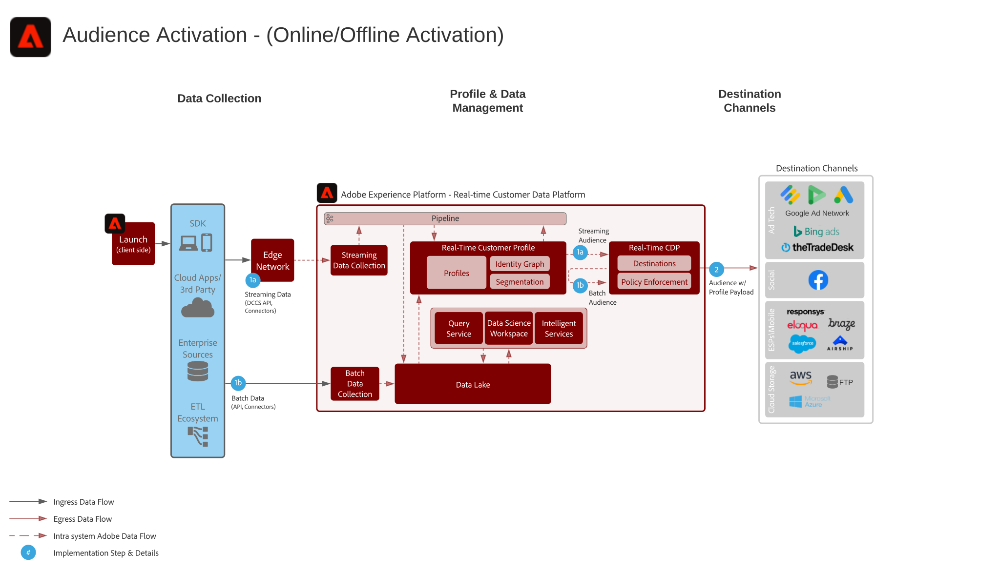

# Online/Offline Audience Activation scenario

Online/Offline Audience Activation.

## Use Cases

* Audience targeting for known audiences on social destinations.
* Augment web/mobile personalization efforts with granular and enriched audiences.
* Build audiences that can be exported for granular targeting and personalization in Email and Mobile messaging systems.

## Architecture

## Prerequisites

* Real-time Customer Data Platform
* Profile Activation

## Guardrails

* [Profile and Segmentation Guidelines](https://experienceleague.adobe.com/docs/experience-platform/profile/guardrails.html?lang=en)

## Implementation Steps

1.  Datasets configured, enabled for Profile and data ingested into Platform
1.  Real-time Customer Data Platform segments sharing between Experience Platform and Audience Manager must be provisioned for Audience Manager based destinations and Experience Cloud Audience Sharing.
1.  Define Segments. Segments are systematically set as batch or streaming
1.  Configure Destinations

## Related Documentation

* [Real-time Customer Data Platform Product Description](https://helpx.adobe.com/legal/product-descriptions/real-time-customer-data-platform.html)
* [Profile and Segmentation Guidelines](https://experienceleague.adobe.com/docs/experience-platform/profile/guardrails.html?lang=en)
* [Segmentation documentation](https://docs.adobe.com/content/help/en/experience-platform/segmentation/api/streaming-segmentation.html)
* [Destinations documentation](https://docs.adobe.com/content/help/en/experience-platform/rtcdp/destinations/destinations-cat/destinations-catalog.html)

## Related Videos & Tutorials

* [Real-time CDP overview](https://experienceleague.adobe.com/docs/platform-learn/tutorials/application-services/rtcdp/understanding-the-real-time-customer-data-platform.html)
* [Demo of Real-time CDP](https://experienceleague.adobe.com/docs/platform-learn/tutorials/application-services/rtcdp/demo.html)
* [Create segments](https://experienceleague.adobe.com/docs/platform-learn/tutorials/segments/create-segments.html)