# Audience Activation blueprint

Audience-first activation is the key to success in a data-driven marketing world. However, many brands are still focusing their efforts on channel-first activation, which often delivers inconsistent reach and personalization. With a channel-first approach, each channel acts as a silo in which personalization efforts target only the customers interacting with the brand on that channel. The problem with this approach is that it doesn’t reflect the reality that customers interact with brands across many different touchpoints. Channel-first activation cannot connect customers’ behavior through their interactions across multiple channels resulting in lost opportunities for stronger engagement and the revenues it generates.

<!--
test

Technical Customer Presentation for Audience Activation Blueprint.pptx

Audience Activation Blueprint XD Demo Script.pdf

Audience Activation Blueprint XD Demo.xd

Audience Activation Blueprint XD Demo Walk Through.mp4

Audience Activation Blueprint Architecture.pptx

Audience Activation Blueprint - Prerequisites, Guardrails, & Data Definitions.pdf

Logistical
Put in platform-learn repo
How to do the left navigation

Questions: 

Who is the audience for these pages? 

Internal Adobe people, sales, consultants, etc that we wold direct to this page
Partner and Customer architects
A pinch of business use case with technical guide

How would they find the page?
Why would they come here?
What are they here to do?

What content should

Some issues in the blog content related to the use of terminology RTCDP vs RTCP
Various links need to be added that are on the 

PDF says "Confidential – Use as Internal Only Reference". Is that not the case anymore?
Does the lack of Launch under tag-management make it look like it is not supported?
Is "Ad Cloud" on brand?
There is a lot of content written about what third party software companies do. Is that legit?
Should Web SDK be added as a data source?
Updated non-brand abbreviations like RTCDP and AEP
What is meant by "Order of Ingestion"? Does this mean that CRM data is ingested before Web Analytics data? I'm confused by what this is representing. Each heading should have a description to clarify what the table means
"Profile attributed" should this read "Profile attributes"?
What is "p95"?
Removed internal links from "References"
Staring State – ​ Anonymized Web and Advertising Activation​ "Starting state"?
Need to add back bullets into scenarios table or perhaps format the Scenarios content differently

Notes from Nick
Use cases

Quick Overview
Scenarios
Example Use Cases
Reference Architecture
    Diagram with notes from slide

Prerequisites
Guardrails
Implementation Steps
FAQ&Reference

Do we want a different page foreach scenario?
-->

## One example of a common use case

Let’s say our customer, Sarah, visits a retailer and purchases a sports helmet that makes her eligible for a cross-sell offer. But with channel-first activation, signals from all the different online touchpoints that Sarah has in the next 24 hours, such as targeted ads and sponsored content, would not be aware of her original purchase because the channels are not connected. Each channel only knows what is happening locally instead of knowing what Sarah is doing across all possible interactions. The result is a disconnected customer journey in which the brand is unable to deliver the right experience to Sarah at the time when her engagement and the likelihood of upselling are the highest.

Successful intent-based marketing strategies require a shift from channel-first activation to audience-first activation. Audience activation allows brands to connect customer interactions across multiple channels to deliver a centralized audience that can be activated to all channels. In a connected customer journey, the moment Sarah purchases her helmet in the store, downstream systems are altered in real-time to show her related products that complement the purchase she just made.

Brands that want to harness audience-first activation need a single system to manage behavioral and personal data with scale, speed, and precision. Adobe Experience Platform Real-time CDP provides this. With its ability to combine pseudonymous behavioral data, which is critical for determining what message to deliver next, and personal data, which is key to understanding who the customer is, Real-time Customer Profile provides audience activation in milliseconds.

Building on our earlier example, with audience activation using Real-time Customer Profile, when Sarah buys her helmet, that purchase information is available immediately, triggering a lookup within Sarah’s customer profile indicating that she now qualifies for the segment defined as customers who have purchased that particular helmet. In this case, Sarah is now qualified to receive an accessory offer that complements the product she purchased. At the same time, Sarah is disqualified from the segment that would have served her ads for the helmet she just purchased. With audience-first activation, this updated profile can be delivered to any one of a number of destination channels for activation when Sarah next interacts with the brand.

## Implementation Prerequisites for Implementing the Audience Activation Blueprint

In order for the solution provided in the Blueprint for Audience Activation to function properly, you will need to have the following prerequisites in place:

### Identity Prerequisites

* Sharing of audiences to destinations requires that the primary identity keys required of the destination are captured or ingested into Adobe Experience Platform Identity Service.

### Technology Implementation Prerequisites

* Adobe Experience Platform with Real-time Customer Profile and Real-time CDP must be provisioned.
* Bi-Directional Segmentation Sharing is provisioned for all Adobe Experience Platform deployments.

### Destination Settings

* Each destination will have specific configuration settings that must be addressed prior to ingesting the audience export from Adobe Experience Platform. These settings can be found in the documentation for each destination.

### Availability

* North America, EMEA, APAC, and Americas
* Only available on Production sandbox

### The architecture of Audience Activation

Now, with Adobe’s new Blueprint for Audience Activation, brands can easily implement audience-first activation with Adobe Experience Platform Real-time CDP. The figure below illustrates the architecture built for audience-first activation using Real-time CDP and Adobe Destinations.

With this solution, Adobe Experience Platform Real-time Customer Profile segment exports and streaming segmentation events are leveraged by the platform’s Real-time CDP for sending audiences to different destinations.

Architecture for building an Audience Activation implementation using Adobe Experience Platform’s 
Real-time Customer Data Platform and Adobe Destinations.

Audience Activation Blueprint supports both batch and streaming segmentation, allowing you to activate both scheduled campaigns and real-time streaming campaigns. The delivery cadence is based on the data acceptance of the configured destination whether streaming server to server or batch delivery.

Batch segments share results with a once-per-day latency while streaming segmentation is available within minutes and is captured as events on Adobe Experience Platform Pipeline. Latency is not an issue with the Audience Activation Blueprint. The timing associated with streaming segmentation capabilities of Adobe Experience Platform to provide activation to a third party aligns very well with most use cases. Data is coming in, it is being evaluated, the customer becomes a member of a segment, and the system is able to notify the destination channel of segment membership in a streaming fashion.

For destinations that support streaming segmentation, the segment membership events are pulled from Adobe Experience Platform Pipeline and sent at the cadence supported by the destination. For destinations that only support batch segmentation, the segment membership is pulled from the segment export dataset at the defined schedule. The segment job runs at a pre-defined time for the IMS org, then the destination schedule initiates a segment export job. Once the segment export job is completed, Adobe Real-time CDP delivers the segment memberships.

### Guardrails that come with the Audience Activation Blueprint

You can find the current guardrails for the Real-time Customer Profile here: [https://docs.adobe.com/help/en/experience-platform/profile/guardrails.html](https://docs.adobe.com/help/en/experience-platform/profile/guardrails.html)

## Order of Operations/Implementation Diagram

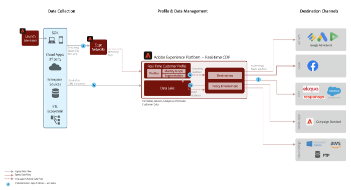

## Operational Activity Required to Implement a Blueprint

Adobe offers solutions for the activation of audiences for various scales depending on the overall requirement. Although the actual sizing of the requirement is captured after a detailed workshop with the customer team, broadly the scale of implementation is categorized in the streams below:

* Adobe Analytics Data Source (Connector): The assumption is that Adobe Analytics is required for Audience Activation. Additionally, the customer must select one IMS Org ID.
* Other data sources: Work may be required to model into Adobe Experience Platform XDM.
* Data Science Workspace Modeling (Optional): Build a new model or onboard your own data science model.
* Segments: Segment sharing would be once in a day configuring of audiences through Real-time Customer Profile Segment Builder.
* Destinations: Configure Real-time Customer Data Platform Destinations.

## Presentation

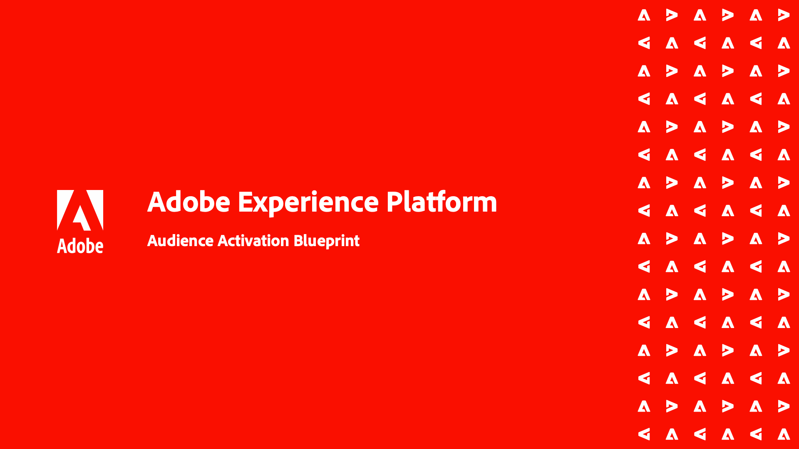

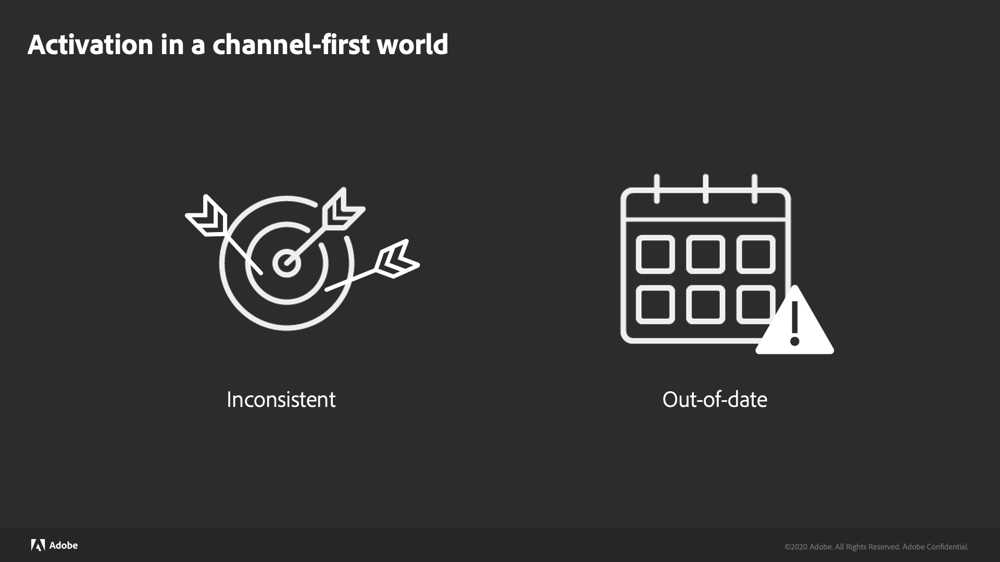
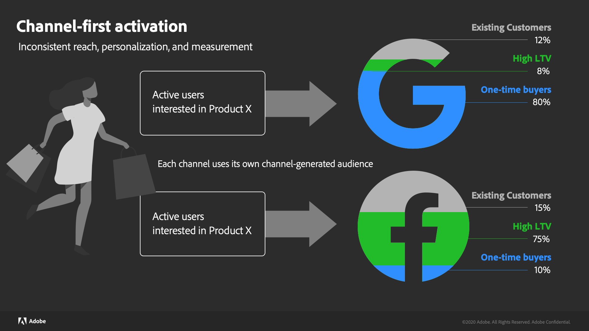

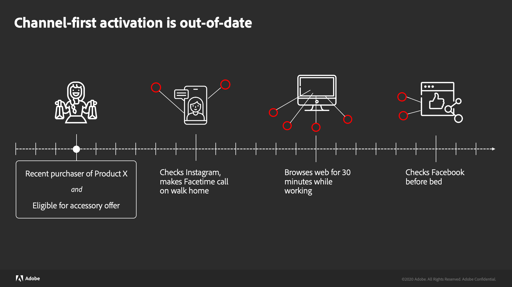
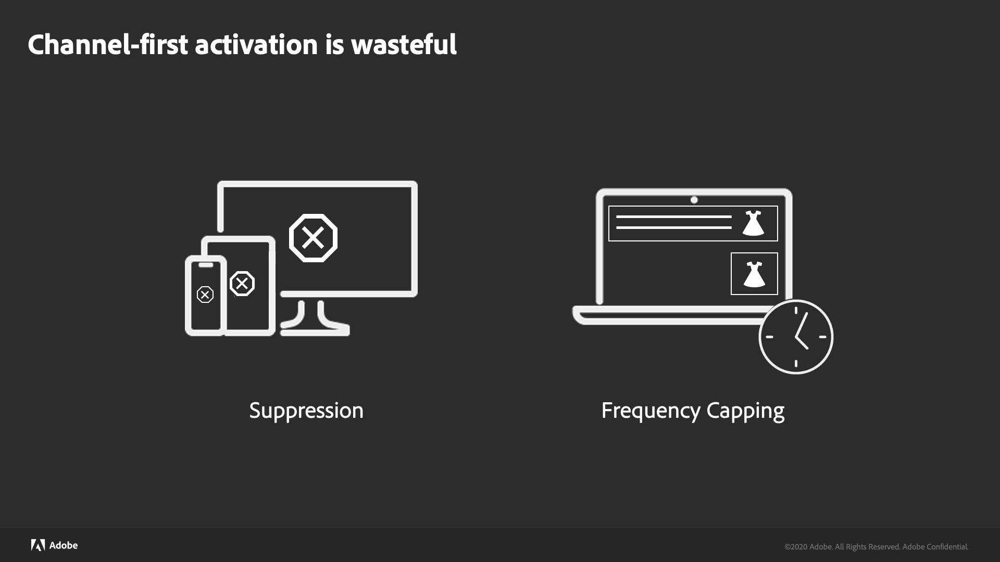
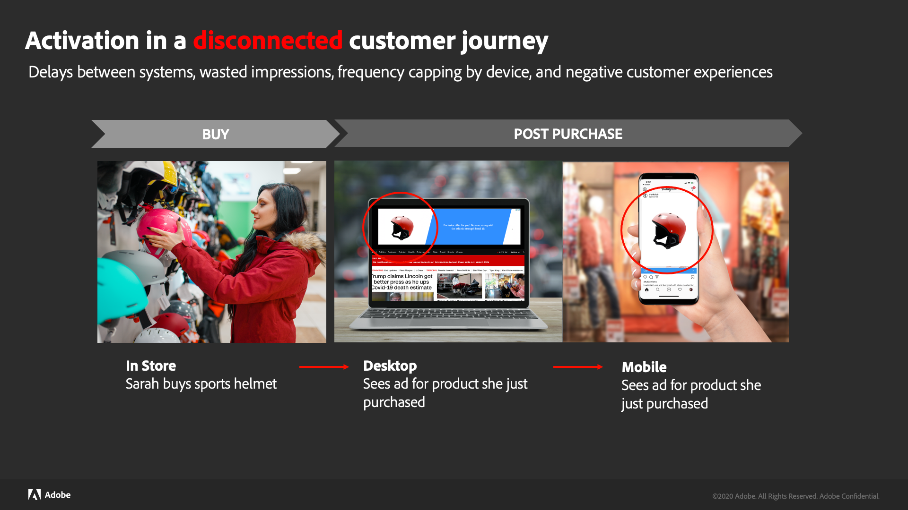

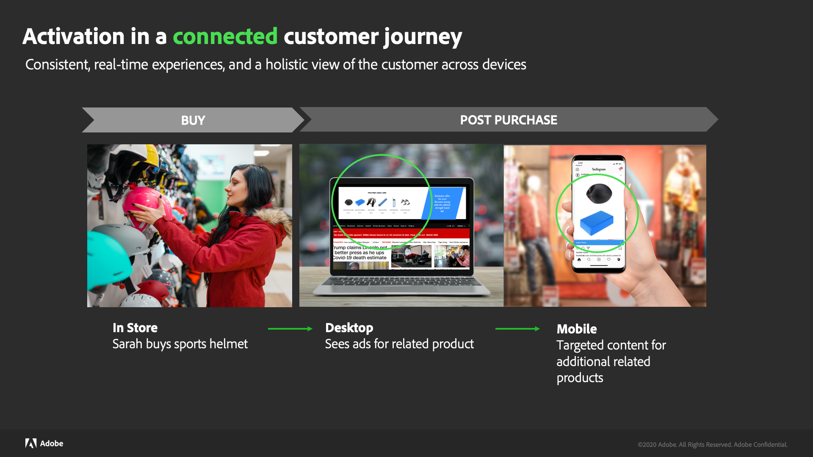
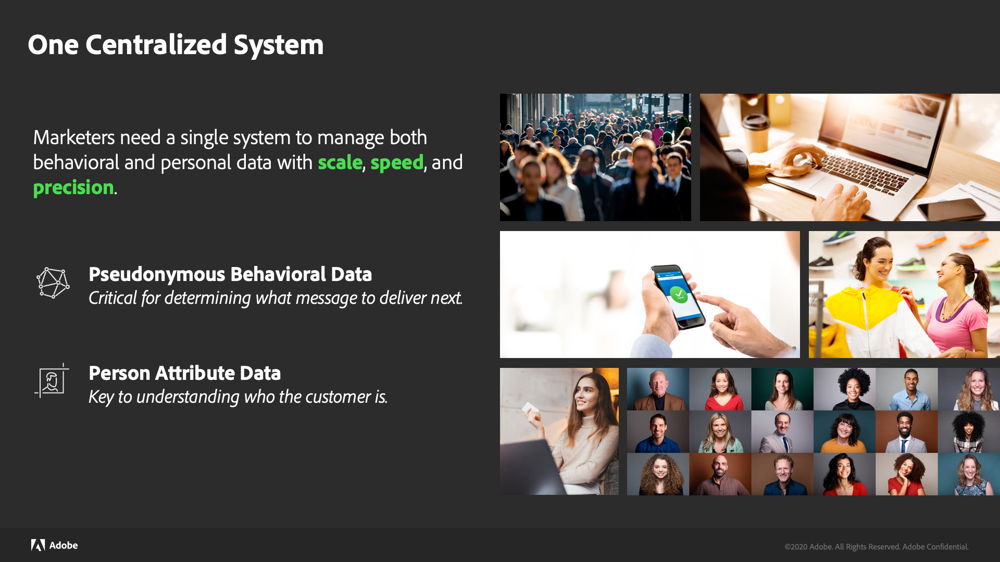
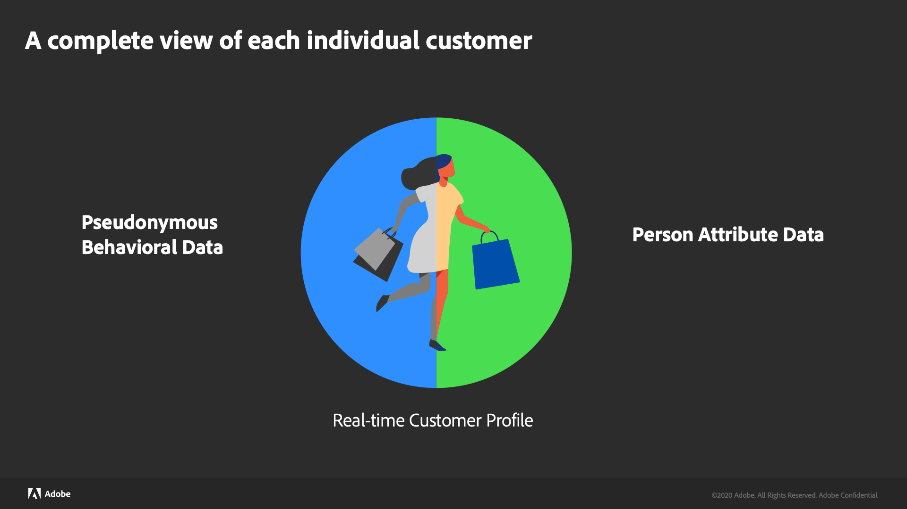
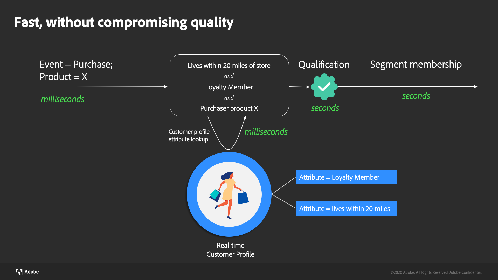

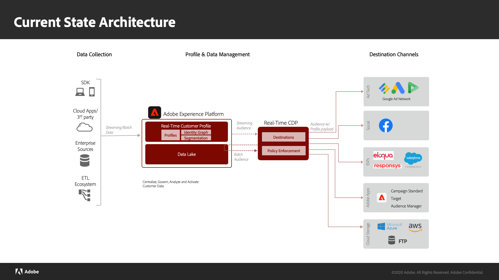
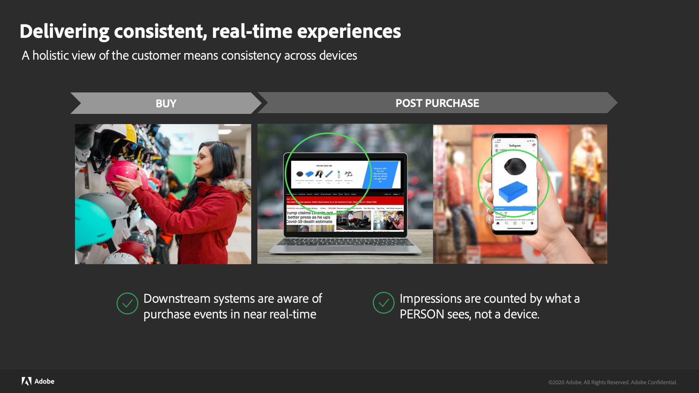
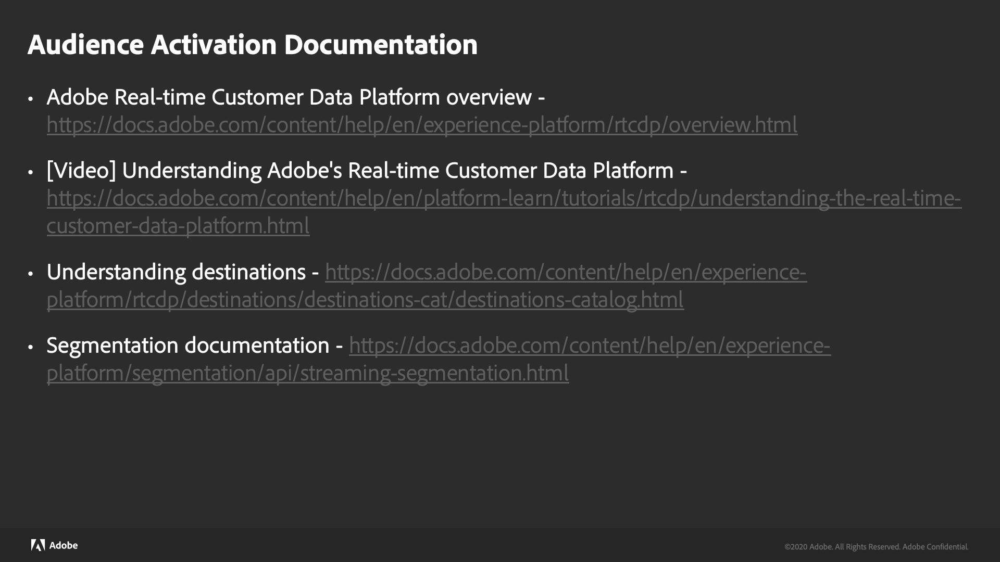

## Scenarios

| #​ | Scenario​ | Description​ | Experience Cloud Apps​ |
|--- |--- |--- |--- |
| 1 |​ *Starting State* – ​ Anonymized Web and Advertising Activation​ | Target audiences across web and advertising channels for anonymized/behavioral customer data.​    Integrate with 3rd party audience data for increased personalization.​ | Adobe Audience Manager​ |
| 2 |​ *Intermediate State* –​ Online/Offline + Pii Activation ​| Activate to Pii and profile based destinations such as email providers, social networks, ad destinations that accept customer audience lists. ​  Activation against online and offline attributes and events (orders, transactions, CRM or loyalty data).​ | Real-time CDP   Adobe Audience Manager (optional)​ |
| 3​ | Advanced State –​ Omni-channel Activation​ | Integrate the Real-time Customer Profile to 3rd party applications such as loyalty, sales, and support to power consistent profile context across channels.​ | Real-time CDP   Adobe Experience Platform Profile Activation​   Adobe Audience Manager (optional)​ |

## Implementation Prerequisites

### Key Prerequisites

* Sharing of audiences to destinations requires that the primary identity keys required of the destination are captured or ingested into Adobe Experience Platform Identity Service.

### Provisioning

* Adobe Experience Platform with Real-time Customer Profile and Real-time Customer Data Platform (Real-time CDP) must be provisioned.
* Streaming segmentation requires high frequency segmentation to be provisioned.

### Availability

* North America, EMEA, APAC, Americas
* Only available on Production sandbox

### Destination Settings

* Each destination will have specific configuration settings that must be addressed prior to ingesting the audience export from Experience Platform. See the documentation for each destination to ensure you have the proper implementation and configurations in place.

## Data Sources

### Data source types

Definition of category of data - DX, Customer-Sourced

| Data Source Type | Source System | Adobe / Non-Adobe |
|--- |--- |--- |
| DMP | Adobe Audience Manager, Oracle, Bluekai, etc.|  Adobe/Non-Adobe |
| Web Analytics | Adobe Analytics, Google Analytics, etc. | Adobe/Non-Adobe |
| Tag Management | Tealium | Non-Adobe |
| Marketing | Adobe Campaign, Eloqua, Adobe Marketo, Responsys, Hubspot, etc. | Adobe/Non-Adobe |
| CRM (Sales, Service, Marketing) | Dynamics CRM, Salesforce, Oracle Engagement Cloud, etc. | Non-Adobe |
| Advertising | Ad Cloud, Google Ad, Bing, AppNexus | Adobe/Non-Adobe |

### Description of data sources

Description of the purpose of the data source, or some business-oriented definition, suggested mixins

| Source System | Description | Out-of-the-box Mixins Recommendation | Additional Custom Mixins Required |
|--- |--- |--- |--- |
| Adobe Audience Manager | Audience Manager helps you bring your audience data assets together, making it easy to collect commercially relevant information about site visitors, create marketable segments, and serve targeted advertising and content to the right audience. Furthermore, Audience Manager offers easy tag deployment and management with robust data collection, control, and protection. |  Schemas and mixins automatically created by source connector | Yes |
| Adobe Analytics | Adobe Analytics is a leading solution that helps to understand customer segments and deliver better customer experiences to them. With the help of Adobe Analytics, you can give better personalized digital channel experiences. |  Schemas and mixins automatically created by source connector | Yes |
| Tealium | Tealium is an Enterprise Tag Management System. Tealium's web-based services make it easy for digital marketers to deploy and manage their third-party vendor tags, and then correlate the data those tags generate into an  actionable source. |  No out-of-the-box schema/mixins available |  Yes |
| Eloqua | Eloqua is a marketing automation platform (MAP), now owned by Oracle. This software is used by marketers, primarily B2B marketers, to help automate the lead generation process. | No out-of-the-box schemas/mixins available | Yes | 
| Salesforce | Salesforce is a CRM application. It provides customer relationship management services and also sells a complementary suite of enterprise applications focused on sales, customer service, marketing automation, analytics, quoting, and application development to name a few. | Out-of-the-box if Salesforce source connector is used. Custom mixins if source connector is not used. | Yes |

### Minimum values

Minimum values associated with that data source to make the Blueprint operate (example is ID namespace description, description of types of fields used on profile to personalize (keeping in mind use case is segment definition / attribute based))

| ID Namespace | Description | Typical Other Fields |
|--- |--- |--- |
| CRM ID | Custom Identity Namespace | First Name, Last Name, Address, Email, Phone, Social ID, Age, Opt-in, Opt-out, etc. |
| Marketing ID | Custom Identity Namespace | First Name, Last Name, Email, Phone, Opt-In, Opt-out |
| Lead ID | Custom Identity Namespace | First Name, Last Name, Product Interest, Email, Phone, Address, etc. |
| Tealium ID | Custom Identity Namespace | |
| ECID | Standard Identity Namespace | |
| Email | Standard Identity Namespace | |
| Adobe Analytics (Legacy ID) | Standard Identity Namespace | Browser properties, URLs, etc. |
| Google Ad ID (GAID) | Standard Identity Namespace | |
| Apple IDFA (ID for Advertisers) | Standard Identity Namespace | |

### Data velocity and considerations

Logistical details about velocity of data & other considerations

| Data Source | Number of records Per Day (Max) | Latency (Profile Hydration) |
|--- |--- |--- |
| Adobe Analytics | 10 M | < 1 Minute @ 100 K RPS |
| Adobe Audience Manager | 20 M | < 1 Minute @ 100 K RPS |
| Batch Ingestion | 10 M | < 10 GB – 10 Minutes |

### Order of Ingestion

| Data Source | Type | Examples |
|--- |--- |--- |
| CRM | Batch Ingestion | Dynamics CRM, Salesforce, Oracle Engagement Cloud |
| Tag Management | Batch Ingestion | Tealium |
| Marketing | Batch Ingestion | Adobe Campaign, Eloqua, Adobe Marketo, Responsys, Hubspot, etc. |
| DMP | Streaming Ingestion | Adobe Audience Manager, Oracle, Bluekai |
| Web Analytics | Streaming Ingestion | Adobe Analytics, Google Analytics |

### Activation

| Activation Type | Path | Examples |
|--- |--- |--- |
| Real-time CDP | Platform > Platform Destinations | Eloqua, Responsys, Amazon S3, Facebook, etc. |
| Audience Manager | Platform > AAM > AAM Destinations | People-based destinations, Device-based destinations, etc. |

## Guardrails

### Data Ingestion Guardrails

| Description | Guideline |
|--- |--- |
| Data lake ingestion - batch API throughput | 7GB per hour |
| Data lake ingestion - Blob, S3, FTP, SFTP throughput | 200GB per hour |
| Profile max record size | 2kb per record | 
| Batch processing to profile throughput | 120GB per hour   <10 GB ~ 10 minutes    100 GB ~ 100 minutes   200 GB ~ 200 minutes |
| Streaming to profile throughput | ~100k requests per second processed to profile in under 1 min |

### Profile Guardrails

| Description | Guideline |
|--- |--- |
| Max size per profile fragment | 10kb – soft, 1MB hard limit; 200kb for total merged across fragments |
| Max number of datasets and identities per profile | 20 datasets, 50 identities |
| Max number of Experience Events | 5,000 events at 2kb per event |
| Optimal array cardinality | <=10 |
| Max JSON depth for id field | 4 |
| Max number of related dimensional entities | 5 entities, 200MB per entity, record type only, 1 dataset per related entity |
| Profile lookups | 20,000 request per second, p95 <500ms |

### Batch Segmentation Guardrails

| Description | Guideline |
|--- |--- |
| Platform Batch segment jobs per day | Up to 6 jobs per day, 5,000 segments can be evaluated per job |
| Platform Time to process batch segment result | 1.5 hours for 10TB profile store, p95   2.5 hours for 100TB profile store, p95 |
| Analytics segment sharing limitations | Maximum of 75 audiences to be shared for each Analytics report suite  If the customer has AAM, no limit on # of Analytics segments shared |
| Time to share segment | First time segment is created, ~6 hours to sync with segment sharing service   After initial segment creation, segment membership is available within minutes after segment job completion   Audience membership is available for targeting after first page visit, initial page view is to establish identity |

### Streaming Segmentation Guardrails

| Description | Guideline |
|--- |--- |
| See segmentation guardrails in the streaming segmentation documentation | [https://www.adobe.com/go/segments-streaming-api-en](https://www.adobe.com/go/segments-streaming-api-en) |

### Activation Service Guardrails

| Description | Guideline |
|--- |--- |
| Segment evaluations and export schedules | Once per day per batch   Working to increase this over time |
| File exports | Exports are split into 5 million record files   5GB max file size   No limit on the number of files to be delivered   Note: Individual destinations may have additional constraints. |
| Types of attributes exported | Profile attributed can be exported and delivered   Currently, exporting  ExperienceEvents are not supported  Streaming destinations, currently only segment membership is supported |
| # of attributes | No limit on the number of attributes exported or delivered  Note: Individual destinations may have additional constraints. |
| # of segments sent to a destination | No limit |
| # of destinations mapped to a segment | No limit |

### Destination Guardrails

| Description | Guideline |
|--- |--- |
| Ads: Google Ad Manager, Google Ads, Google Display and Video 360 | Micro-batch delivery every few minutes   Merge policy agnostic, will send any ID available for the Google match |
| Cloud Storage: Amazon S3, SFTP | 1 daily export   Exported file format is CSV   File format: *`<destination_name>_<segmentId>_<yyyymmdd>`* |
| Cloud Stream: Azure EventHub, Amazon Kinesis |  Micro-batch every few minutes    Only segment membership is shared today |
| ESP: Campaign ACS, Oracle Eloqua, Oracle Responsys, Salesforce Marketing Cloud | SFTP   1 daily export   Exported file format is CSV   File format: *`<destination_name>_<segmentId>_<yyyymmdd>`* |
| Social: Facebook | Micro-batch every few minutes   Identity must be Email_LC_SHA256, can also activate using raw email address and it will be hashed on send   Merge policy must be set to “no-stitch” |

## References

* [Streaming Service Documentation](https://www.adobe.com/go/segments-streaming-api-en)