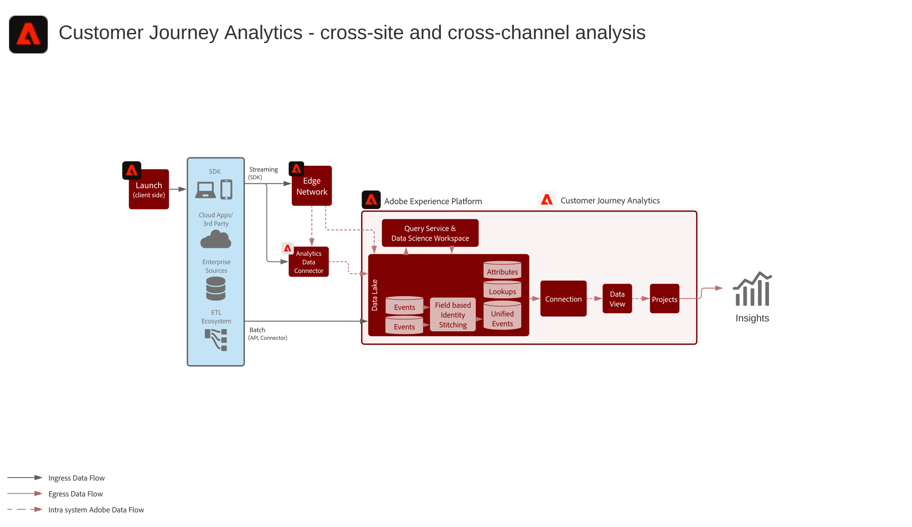

# Call Deflection Journey Analysis scenario

Analyze what behavior a user exhibits prior to calling the call center. Understanding what actions a user was attempting to make,  what content they were viewing and what terms they were searching for prior to a support call can help identify opportunities to improve the customer journey. What content and self-service tools can be improved to help customers resolve issues without needing to call in?

## Use Cases

* Unify customer interactions across desktop and mobile to analyze customer behavior prior to agent-assisted calls or support chats to determine what actions most often result in the user pursuing agent-assisted interactions.

## Reference Architecture

## Integration Patterns

* Adobe Experience Platform → Customer Journey Analytics
* Adobe Analytics → Adobe Experience Platform → Customer Journey Analytics

## Prerequisites

* Adobe Experience Platform
* Customer Journey Analytics

## Guardrails

Availability: Global

Sandbox support: Sandbox compliant (Org must be enabled for sandboxing) datasets from sandboxes can be selected in the CJA Connector configuration. One sandbox per connector.

Data Ingestion into CJA:

* Data Ingestion to Lake: API – 7GB/hr, Connector – 200GB/hr, streaming to lake ~15min, Analytics connector to lake ~45min
* Once data has been published to Data Lake, it can take up to 90 mins to ingest into CJA.
* Backfill data for loading historical data is also supported via the connection configuration.

## Implementation Steps and Considerations

1.  Data must be ingested into Platform prior to ingestion into CJA. Datasets and schemas configured and data ingested into Platform.
1.  Cross channel event datasets to be analyzed in union must have a common namespace id or be re-keyed through the field based stitching capability.    
 
    >[!NOTE]
    >
    > Customer Journey Analytics does not utilize the Experience Platform Profile or Identity services for stitching today.

1.  Any custom data preparation or use of the field based identity stitching is performed on the data to insure a common key across time series datasets to be ingested into CJA.
1.  Lookup data must have a primary ID that can join to a field in the event data. Counts as rows in licensing.
Profile data must have the same primary ID as the primary ID of the event data.
1.  A data connection is configured to ingest data from Experience Platform to CJA. Once data lands in the data lake it will process into CJA within 90 minutes.
1.  A data view is configured on the connection to select the specific dimensions and metrics to be included in the view. Attribution and allocation settings are also configured in the data view. These settings will then be computed at report time.
1.  A project is then created to configure dashboards and reports within Analysis Workspace.

### Identity Stitching Considerations

* Time-series data to be unioned must have the same id namespace on every record. To tie call center data to anonymized device data the digital ID must be tied to the calling ID. This can occur through several possible mechanisms. 1-the dial number being a unique dial number for that visitor for that time, along with a lookup table to tracks the relationship. 2-require the user to authenticate prior to requesting support and tying this to a identifier determined by the call agent - phone number or email as example. 3- leverage an onboarding partner to assist in typing online device identifiers with known identifiers tied to the support request.
* The union process of unifying disparate datasets requires a common primary person/entity key across the datasets. 
* Secondary keys based unions are not supported at this time.
* The field based identity stitching process allows for re-keying identities in rows based on subsequent  transient id records, such as an authentication id. This allows for resolving disparate records to a single id for analysis at the person level vs. at the device or cookie level.
* Stitching happens once a week. With replay after the stitch.

## FAQs & Reference Documentation

* [Customer Journey Analytics Product Description](https://helpx.adobe.com/legal/product-descriptions/customer-journey-analytics.html)
* [Customer Journey Analytics documentation](https://experienceleague.adobe.com/docs/customer-journey-analytics.html)
* [Customer Journey Analytics tutorials](https://experienceleague.adobe.com/docs/customer-journey-analytics-learn/tutorials/overview.html)

### What are the downstream impacts of data models in CJA?

* Objects and attributes of the same XDM field will merge into one dimension in CJA. To  merge multiple attributes from various datasets into the same CJA dimension, the datasets should reference the same XDM field or schema.