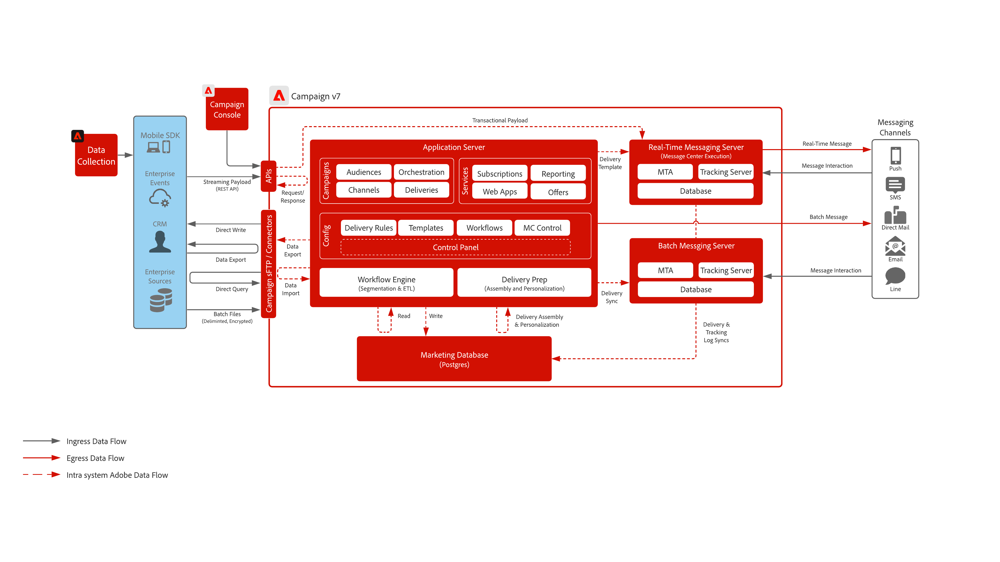

# Campaign v7 Blueprint

Adobe Campaign v7 is a campaigning tool built for traditional marketing channels such as email and direct mail. It provides robust ETL and data management capabilities to help craft and curate the perfect campaign. Its orchestration engine provides for rich multi-touch marketing programs with a core focus on batch-based driven journeys.  It also comes paired with a real-time messaging server that enables marketing teams to send pre-defined messages based on a all-inclusive payload from any IT system for things such as password reset, order confirmation, e-receipt's and much more.

 

## Use Cases

* Batch based messaging programs
* Onboarding and re-marketing campaigns
* Direct Mail advertising, brochure and magazine campaigns
* Low volume simple transactional messaging (i.e. password reset, email receipts, order confirmations, etc.)

 

## Architecture

 

## Blueprint Scenarios

| Scenario | Description | Capabilities |
| :-- | :--- | :--- |
| [Journey Optimizer with Adobe Campaign](ajo-and-campaign.md) | Shows how you can use Adobe Journey Optimizer to orchestrate 1:1 experiences utilizing the Real-Time Customer Profile and leverage the native Adobe Campaign transactional messaging system to send the message | Leverage the Real-Time Customer Profile and power of Journey Optimizer to orchestrate in the moment experiences while utilizing the native real-time messaging capabilities of Adobe Campaign to do the last mile communication  Considerations: <ul><li>Can send up to 50k messages per hour via the Real-Time Message server<li>No throttling is performed from Journey Optimizer so ensure technical vetting by a Pre-Sales Enterprise Architect</li><li>Offer Decisioning is not supported in payloads to the Campaign v7 real-time messaging server</li></ul> |
| [Experience Platform CDP with Adobe Campaign v7](cdp-and-campaign.md) | Showcases how the Adobe Experience Platform and its Real-Time Customer Profile and centralized segmentation tool can be utilized with Adobe Campaign to deliver personalized conversations | <ul><li>Sharing of audiences from the Experience Platform natively with Adobe Campaign v8 via a productized destination</li><li>Native support for ingesting the delivery and interaction data from customer conversations back into the Experience Platform to enhance both the Real-Time Customer Profile and provide cross-channel reporting on messaging campaigns</li></ul> |

 

## Prerequisites

### Application Server and Real-Time Messaging Server

* The Adobe Campaign Client Console is required to interact and use the Campaign v8 software. It is a windows based client and uses standard internet protocols (SOAP, HTTP, etc.). Ensure you have the necessary permissions enabled in your org to distribute, install and run software

* IP Address Allow Listing
    * Identify the IP ranges that all users will leverage during access to the client console 
    * Identity which enterprise systems will be allowed to talk to the Real-Time messaging server and ensure they have a statically assigned IP or range that you can allow list
    * This can be setup and controlled via the Campaign Control Panel
* sFTP Key Management
    * Have SSH public keys available to use with the Campaign provided sFTP. This can be setup and controlled via the Campaign Control Panel.

### Email

* Have a subdomain ready to be used for message sending
* Subdomain can either be fully delegated to Adobe (recommended) or CNAMEs can be used to point to Adobe-specific DNS servers (custom)
* Google TXT record is needed for each subdomain to ensure good deliverability

### Mobile Push

* Have a mobile developer available to deploy, configure and build the mobile app
* Adobe is only providing a SDK to collect the necessary information from FCM (Android) and APNS (iOS) to send message payloads to their servers. How the mobile app needs to be coded, deployed, managed and debugged is the responsibility of the customer

### Webapps (optional)

* Can delegate an additional subdomain for Campaign hosted unsubscribe and landing pages
* SSL certificate is highly encouraged

 

## Guardrails

### Application Server sizing

* Storage can be scaled to up 100M profiles
* Setup and control user access via Adobe Admin Console (recommended) or locally in the application itself
* Data loading to Campaign is expected to be done through batch files
    * API data loading support is primarily for managing of profiles or simple objects within the database (i.e. create and update). It is not intended to be used for loading large volumes of data or batch like operations.
    * Using APIs to read data for custom application purposes is not supported
* API calls are limited to 15 per second or 150k per day at scale

### Batch Messaging Server sizing

* Can scale to handle up to 2.5M messages per hour

### Real-Time Messaging Server sizing

* Can send up to 50k messages per hour 
* By default only one (1) real-time messaging server is provisioned. This is to ensure that any communication with the server is done via a session token which expires in 24hrs
* Optionally you can deploy up to eight (8) real-time messaging servers but authentication then only supports user/pass  
* Recommended approach is always to utilize one real-time messaging server to take advantage of session token based auth where possible

### SMS Configuration

* Campaign provides the ability to integrate with a SMS provider. The provider is procured by the customer and integrated with campaign for sending SMS based messages
* Support is via the SMPP protocol
* There are three (3) different kinds of SMS all of which Adobe can support:
    * SMS MT (Mobile Terminated): an SMS that is emitted by Adobe Campaign towards mobile phones through the SMPP provider.
    * SMS MO (Mobile Originated): an SMS that is sent by a mobile to Adobe Campaign through the SMPP provider.
    * SMS SR (Status Report) or DR or DLR (Delivery Receipt): a return receipt sent by the mobile to Adobe Campaign through the SMPP provider indicating that the SMS has been received successfully. Adobe Campaign may also receive SR indicating that the message could not be delivered, often with a description of the error. 

### Mobile Push Configuration

* Two supported approaches for integrating with mobile devices for push notifications:
    * Experience Platform Mobile SDK (recommended)
    * Campaign Mobile SDK
* Experience Platform Mobile SDK route:
    * Leverage Adobe Tags and the Campaign Classic extension for setting up your integration with the Experience Platform Mobile SDK
    * Need a working knowledge of Adobe Tags and data collection
    * Need mobile development experience with push notifications in both Android and iOS to deploy the SDK, integrate with FCM (Android) and APNS (iOS) to get push token, configure your app to receive push notifications and handle push interactions
* Campaign Mobile SDK
    * Contact Adobe Customer Care to get access
    * Please follow the [Campaign SDK documentation](https://experienceleague.adobe.com/docs/campaign-classic/using/sending-messages/sending-push-notifications/integrating-campaign-sdk-into-the-mobile-application.html?lang=en) to learn how to install and configure the SDK

    >[!IMPORTANT]
    >If you deploy the Campaign SDK and are working with other Experience Cloud applications they will require the use of the Experience Platform Mobile SDK for data collection. This is a different SDK and will need to be installed along side the Campaign SDK
    
 

## Implementation Steps

See the [Getting Started Guide](https://experienceleague.adobe.com/docs/campaign-classic/using/getting-started/starting-with-adobe-campaign/about-adobe-campaign-classic.html?lang=en) for implementing Adobe Campaign v7

## Related Documentation

* [Campaign v7 documentation](https://experienceleague.adobe.com/docs/campaign-classic.html?lang=en)
* [Campaign v7 Product Description](https://helpx.adobe.com/legal/product-descriptions/adobe-campaign-managed-cloud-services.html)
* [Experience Platform Tags documentation](https://experienceleague.adobe.com/docs/launch.html?lang=en)
* [Experience Platform Mobile SDK documentation](https://experienceleague.adobe.com/docs/mobile.html?lang=en)
