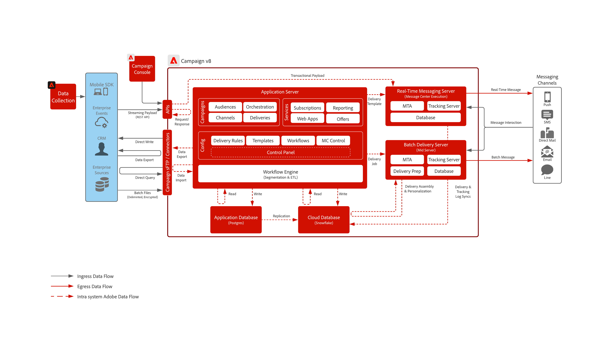

# Adobe Campaign Managed Cloud Services

| Blueprint | Description | Architecture |
|---|---|---|
| **[Adobe Campaign v8](campaign-v8.md)** | Next generation campaigning tool that is optimized for highly complex data management and campaign processes. Enables customers to combine discover and create rich marketing campaign communications |  |
| **[Adobe Campaign v7](campaign-v7.md)** | Traditional campaigning tool built for batch-based marketing campaigns across channels such as email, SMS and direct mail. Enables customers to orchestrate and manage the various customer communications in a single place |  |
