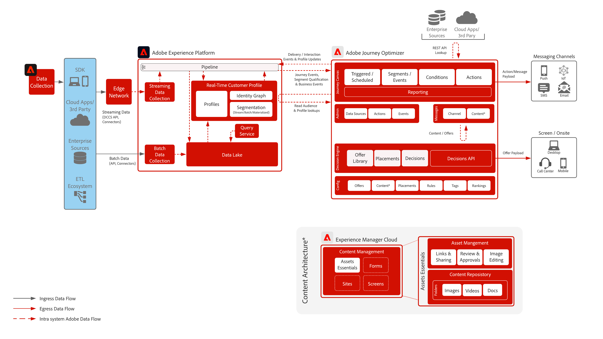
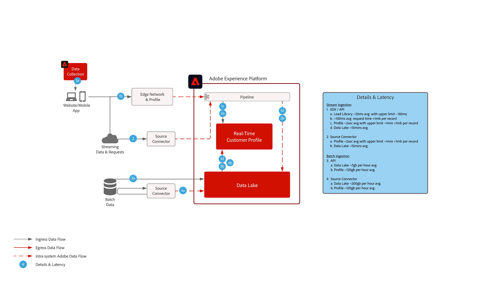
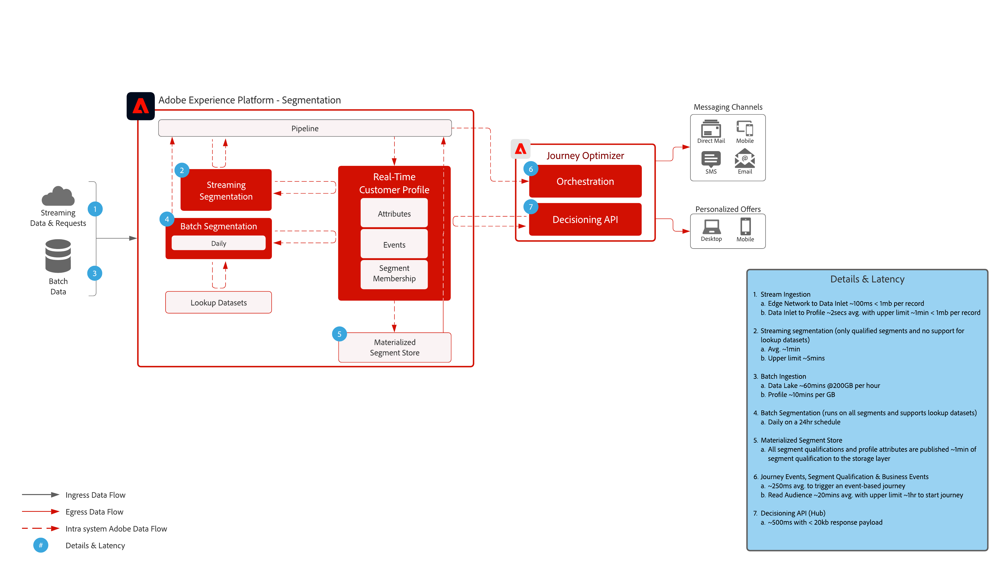

# Journey Optimizer

Adobe Journey Optimizer is a purpose built system for marketing teams to react in real-time to customer behaviors and meet them where they are at. Data management capabilities have been moved to the Adobe Experience Platform allowing marketing teams to focus on what they do best: which is creating world class customer journey's and personalized conversations.  This blueprint outlines the technical capabilities of the application and provides a deep dive into the various architectural components that make up Adobe Journey Optimizer. 

 

## Use Cases

* Triggered messages
* Welcome and registration confirmations
* Shopping cart and application form abandons
* Location triggered messages
* In-stadium experiences
* Travel and hospitality pre-arrival and stay experiences

 

## Architecture

 

## Blueprint Scenarios

| Scenario | Description | Capabilities |
| :-- | :--- | :--- |
| [3rd Party Messaging](3rd-party-messaging.md) | Demonstrates how Adobe Journey Optimizer can be utilized with 3rd party messaging systems to orchestrate and send personalized communications | Deliver 1:1 in the moment personalized communications to customers as they interact with your brand or company  Considerations: <ul><li>3rd party system has to support bearer tokens for authentication</li><li>No support for static IPs due to multi-tenant architecture</li><li>Be aware of architectural constraints on 3rd party system when it comes to API calls per second.  May be a need for the customer to buy additional volume from the 3rd party vendor to support volume coming from Journey Optimizer</li><li>Does not support Offer Decisioning in messages or payloads</li></ul> |
| [Journey Orchestration with Adobe Campaign](ajo-and-campaign.md) | Shows how you can use Adobe Journey Optimizer to orchestrate 1:1 experiences utilizing the Real-Time Customer Profile and leverage the native Adobe Campaign transactional messaging system to send the message | Leverage the Real-Time Customer Profile and power of Journey Optimizer to orchestrate in the moment experiences while utilizing the native real-time messaging capabilities of Adobe Campaign to do the last mile communication  Considerations: <ul><li>Campaign application must be on either v7 build >21.1 or v8</li><li>Messaging throughput</li><ul><li>Campaign v7 - up to 50k per hour</li><li>Campaign v8 - up to 1M per hour</li><li>Campaign Standard - up to 50k per hour</li></ul><li>No throttling is performed so use cases need technical vetting by an Enterprise Architect</li><li>No support for utilizing Offer Decisioning in message sent by Campaign</li></ul> |

 

## Prerequisites

Adobe Experience Platform

* Schemas and datasets must be configured in the system before you can configure Journey Optimizer data sources
* For Experience Event class-based schemas add 'Orchestration eventID field group when you want to have an event triggered that is not a rule-based event
* For Individual Profile class-based schemas add the 'Profile test details' field group to be able to load test profiles for use with Journey Optimizer

Email

* Must have a subdomain ready to be used for message sending
* Subdomain can either be fully delegated to Adobe (recommended) or CNAMEs can be used to point to Adobe-specific DNS servers (custom)
* Google TXT record is needed for each subdomain to ensure good deliverability

Mobile Push

* Customer must have a mobile developer available to build the app 
* Adobe Experience Platform Mobile SDK

 

## Guardrails

[Journey Optimizer Guardrails Product Link](https://experienceleague.adobe.com/docs/journeys/using/starting-with-journeys/limitations.html?lang=en)

Please be aware of these not listed in the link above:

* Batch segments – need to ensure you understand the daily volume of qualified users and ensure the destination system can handle the burst throughput per journey and across all journeys
* Streaming segments – need to ensure the initial burst of profile qualifications can be handled along with the daily streaming qualifying volume per journey and across all journeys
* Natively supports Offer Decisioning in messages only (no custom actions)
* Message types supported:
  * Email
  * Push (FCM / APNS)
  * Custom Actions (via Rest API)
* Outbound integrations to 3rd Party systems
  * No support for a single Static IPs as our infrastructure is multi-tenant (must allow list all datacenter IPs)
  * Only POST and PUT methods are supported for custom actions
  * Authentication via user/pass or authorization token
* No ability to package and move individual components of Adobe Experience Platform or Journey Optimizer between various sandboxes. Must re-implement in new environments

### Data Ingestion Guardrails

 

### Activation Guardrails

 

## Implementation Steps

### Adobe Experience Platform

#### Schema/Datasets

1. [Configure individual profile, experience event, and multi-entity schemas](https://experienceleague.adobe.com/?recommended=ExperiencePlatform-D-1-2021.1.xdm) in Experience Platform, based on customer-supplied data.
1. [Create datasets](https://experienceleague.adobe.com/docs/platform-learn/tutorials/data-ingestion/create-datasets-and-ingest-data.html) in Experience Platform for data to be ingested.
1. [Add data usage labels](https://experienceleague.adobe.com/docs/platform-learn/tutorials/data-governance/classify-data-using-governance-labels.html) in Experience Platform to the dataset for governance.
1. [Create policies](https://experienceleague.adobe.com/docs/platform-learn/tutorials/data-governance/create-data-usage-policies.html) that enforce governance on destinations.

#### Profile/Identity

1. [Create any customer-specific namespaces](https://experienceleague.adobe.com/docs/platform-learn/tutorials/identities/label-ingest-and-verify-identity-data.html).
1. [Add identities to schemas](https://experienceleague.adobe.com/docs/platform-learn/tutorials/identities/label-ingest-and-verify-identity-data.html).
1. [Enable the schemas and datasets for Profile](https://experienceleague.adobe.com/docs/platform-learn/tutorials/profiles/bring-data-into-the-real-time-customer-profile.html).
1. [Set up merge policies](https://experienceleague.adobe.com/docs/platform-learn/tutorials/profiles/create-merge-policies.html) for differing views of [!UICONTROL Real-time Customer Profile] (optional).
1. Create segments for Journey usage.

#### Sources/Destinations

1. [Ingest data into Experience Platform](https://experienceleague.adobe.com/?recommended=ExperiencePlatform-D-1-2020.1.dataingestion) using streaming APIs & source connectors.

### Journey Optimizer

1. Configure your Experience Platform data source and determine what fields should be cached as part of the profileStreaming data used to initiate a customer journey must be configured within Journey Optimizer first to get an orchestration ID. This orchestration ID is then supplied to the developer to use with ingestion
1. Configure external data sources.
1. Configure custom actions.

### Mobile Push Configuration

1. Implement Experience Platform Mobile SDK to collect push tokens and login information to tie back to known customer profiles
1. Leverage Adobe Tags and create a mobile property with the following extension:
1. Adobe Journey Optimizer
1. Adobe Experience Platform Edge Network
1. Identity for Edge Network
1. Mobile Core
1. Ensure you have a dedicated datastream for mobile app deployments vs. web deployments
1. For more information follow the [Adobe Journey Optimizer Mobile Guide](https://aep-sdks.gitbook.io/docs/using-mobile-extensions/adobe-journey-optimizer)

## Related Documentation

* [Experience Platform documentation](https://experienceleague.adobe.com/docs/experience-platform.html?lang=en)
* [Experience Platform Tags documentation](https://experienceleague.adobe.com/docs/experience-platform/tags/home.html?lang=en)
* [Experience Platform Mobile SDK documentation](https://experienceleague.adobe.com/docs/mobile.html?lang=en)
* [Journey Optimizer documentation](https://experienceleague.adobe.com/docs/journey-optimizer/using/ajo-home.html?lang=en)
* [Journey Optimizer Product Description](https://helpx.adobe.com/legal/product-descriptions/adobe-journey-optimizer.html)
