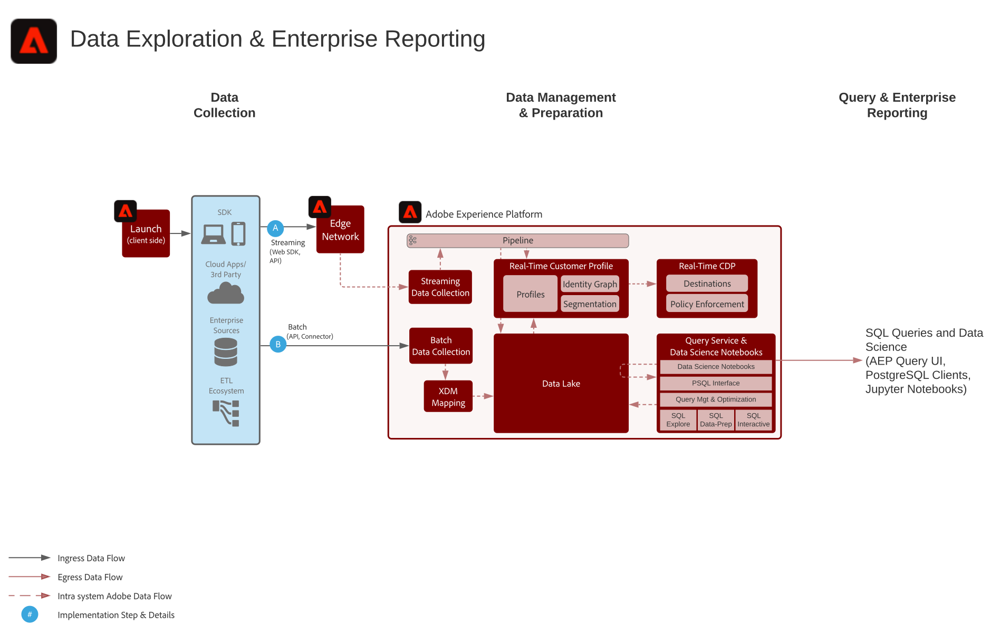

# Enterprise Data Exploration and Reporting Blueprint

Enterprise Data Exploration and Reporting comprises the ability within Adobe Experience Platform to perform exploratory query and analysis of the data that exists in the data lake.

Experience Platform's Query Service allows SQL queries to be performed on the data. The Data Science Workspace enables data exploration, data science, and machine learning workloads to be performed on the data. 

In addition, Experience Platform allows connections with third-party SQL clients, interfaces, and Business Intelligence (BI) tools to directly connect to, access and query the data within Experience Platform, using the PostgreSQL protocol.

Certain guardrails apply for the query timeout and for the amount of data that is included in the query result, as noted within the scenario details.

## Use Cases

* Interactive query and aggregation of data
* Row and column access to ingested data for exploration and validation
* Dashboarding and visualization of data via Business Intelligence tooling

## Applications

* Adobe Experience Platform

## Scenarios

| Scenario | Description |  Experience Cloud Applications/Services | 
|---|---|---|
| **Data Exploration - raw query of data**  | <ul><li>Write and perform SQL queries in the data lake using the interactive query user interface or a connected SQL client. Data Science Workspace can also be used to query and gain insight from the raw data in Experience Platform.</li></ul> | <ul><li>Adobe Experience Platform</li></ul>|
| **Enterprise Dashboarding**  | <ul><li>Connect Business Intelligence tools to Experience Platform to visualize data for dashboarding and reporting use cases.</li></ul> | <ul><li>Adobe Experience Platform</li></ul>|  

## Architecture

## Guardrails

* 10-minute time limit for interactive queries
* 100-record limit returned in the UI
* 50,000-record limit returned via the SQL connector

## Implementation Steps

1.  Configure datasets and schemas for data ingestion into the data lake.
1.  Ingest data.
1.  Confirm that data is available to Query Service and Data Science Workspace for raw access and query.
1.  Connect Business Intelligence tools and SQL clients to Query Service for visualization, data query, and exploration.

## Related Documentation

* [Adobe Experience Platform Intelligence product description](https://helpx.adobe.com/legal/product-descriptions/adobe-experience-platform-intelligence---product-description.html)
* [Query Service documentation](https://experienceleague.adobe.com/docs/experience-platform/query/home.html?lang=en)
