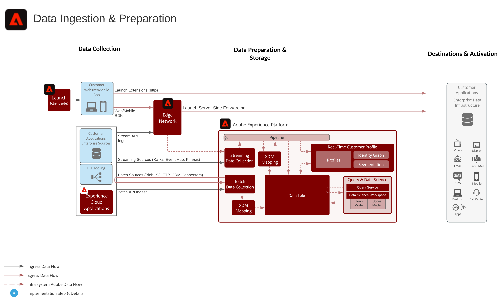

# Data Preparation and Ingestion Blueprint

Data ingestion and preparation blueprint encompasses all the methods by which data can be ingested and prepared in Adobe Experience Platform.

Data preparation includes the concepts of mapping source data to XDM (Experience Data Model) schema. It also includes performing transformations on data including date formatting, field splitting/concatenation/conversions, joining/merging/re-keying of records. This facilitates unifying customer data for providing aggregated/ filtered analysis including reporting or preparing data for customer profile assembly/data science/activation.

## Data Ingestion Methods

| Methods of Ingestion         | Description                                                                                                                                                                                                                                                                                                                                                                                                                             |
|------------------------------|-----------------------------------------------------------------------------------------------------------------------------------------------------------------------------------------------------------------------------------------------------------------------------------------------------------------------------------------------------------------------------------------------------------------------------------------|
| Web/Mobile SDK               | Latency: Real-time - same page collection to Experience Edge Streaming ingestion to Profile ~1 min Streaming ingestion to Data Lake (micro batch ~15 minutes) Documentation:  [WebSDK](https://experienceleague.adobe.com/docs/experience-platform/edge/home.html?lang=en) [MobileSDK](https://experienceleague.adobe.com/docs/mobile.html?lang=en)                                                                     |
| Streaming Sources            | Latency: Real-time - same page collection to Experience Edge Streaming ingestion to Profile ~1 min Streaming ingestion to Data Lake (micro batch ~15 minutes) [Documentation](https://experienceleague.adobe.com/docs/experience-platform/sources/home.html?lang=en#connectors)                                                                                                                                               |
| Streaming API                | Latency: Real-time - same page collection to Experience Edge Streaming ingestion to Profile ~1 min Streaming ingestion to Data Lake (micro batch ~15 minutes) [Documentation](https://experienceleague.adobe.com/docs/experience-platform/ingestion/streaming/overview.html?lang=en#what-can-you-do-with-streaming-ingestion%3F)                                                                                              |
| ETL Tooling                  | Use ETL tools do modify and transform enterprise data prior to ingestion into Experience Platform. Latency: Timing dependent on external ETL tool scheduling then standard ingestion guardrails apply based on the method used for ingestion.                                                                                                                                                                                                     |
| Batch Sources                | Scheduled fetch from sources [Documentation](https://experienceleague.adobe.com/docs/experience-platform/sources/home.html?lang=en#connectors)                                                                                                                                                                                                                                                                                         |
| Batch API                    | Latency: Batch ingestion to Profile dependent on size and traffic loads ~45 min Batch ingestion to Data Lake dependent on size and traffic loads [Documentation](https://experienceleague.adobe.com/docs/experience-platform/ingestion/batch/overview.html?lang=en#batch)                                                                                                                                                        |
| Adobe Application Connectors | Automatically ingest data that is sourced from Adobe Experience Cloud Applications [Analytics](https://experienceleague.adobe.com/docs/experience-platform/sources/connectors/adobe-applications/analytics.html?lang=en#connectors) [Audience Manager](https://experienceleague.adobe.com/docs/experience-platform/sources/connectors/adobe-applications/audience-manager.html?lang=en#connectors) |

## Data Preparation Methods

| Methods of Data Preparation                                | Description                                                                                                                                                                                                                                                                                    |
|------------------------------------------------------------|------------------------------------------------------------------------------------------------------------------------------------------------------------------------------------------------------------------------------------------------------------------------------------------------|
| Data Science Workspace - Data Prep                         | Model driven transformation, Scripted transformation. [Documentation](https://experienceleague.adobe.com/docs/experience-platform/data-science-workspace/home.html?lang=en)                                                                                                                   |
| External ETL Tool (Snaplogic, Mulesoft, Informatica, etc.) | Perform complex transformations in ETL tooling and leverage standard Experience Platform Source APIs or Connectors to ingest the resultant data.                                                                                                                                                               |
| Query Service - Data Prep                                  | Joins, Splits, Merge, Transform, Query and Filter data into a new dataset. Using CTAS (Create Table as Select) [Documentation](https://experienceleague.adobe.com/docs/experience-platform/query/home.html?lang=en#sql)                                                                       |
| XDM Mapper & Data Prep functions (Streaming and Batch)     | Map source attributes in CSV or JSON format into XDM attributes during Experience Platform ingestion. Compute functions on data as it is ingested - i.e. data formatting, splitting, concat, etc. [Documentation](https://experienceleague.adobe.com/docs/experience-platform/data-prep/home.html?lang=en) |

## Related Blog Posts

* [Leveraging External Data Platforms in Adobe Experience Platform Journey Orchestration](https://medium.com/adobetech/leveraging-external-data-platforms-in-adobe-experience-platform-journey-orchestration-54fc6134fe17?source=your_stories_page-------------------------------------)
* [High Throughput Ingestion with Iceberg](https://medium.com/adobetech/high-throughput-ingestion-with-iceberg-ccf7877a413f?source=your_stories_page-------------------------------------)
* [Query Service Tricks in Adobe Experience Platform (Writing Queries and Storing Derived Datasets)](https://medium.com/adobetech/query-service-tricks-in-adobe-experience-platform-writing-queries-and-storing-derived-datasets-eaee0d6d683e?source=your_stories_page-------------------------------------)
* [Digging into Adobe Experience Platform’s Experience Data Model to More Fully Understand the Power of Real-time Customer Profile](https://medium.com/adobetech/digging-into-adobe-experience-platforms-experience-data-model-to-more-fully-understand-the-power-3e109271e04f?source=your_stories_page-------------------------------------)
* [An Introductory Look at Exploratory Data Analysis on Adobe Experience Platform](https://medium.com/adobetech/an-introductory-look-at-exploratory-data-analysis-on-adobe-experience-platform-1bfce7501d9a?source=your_stories_page-------------------------------------)
* [Modeling XDM Data for Data Science at Scale on Adobe Experience Platform](https://medium.com/adobetech/modeling-xdm-data-for-data-science-at-scale-on-adobe-experience-platform-222bb2a6dbf7?source=your_stories_page-------------------------------------)

