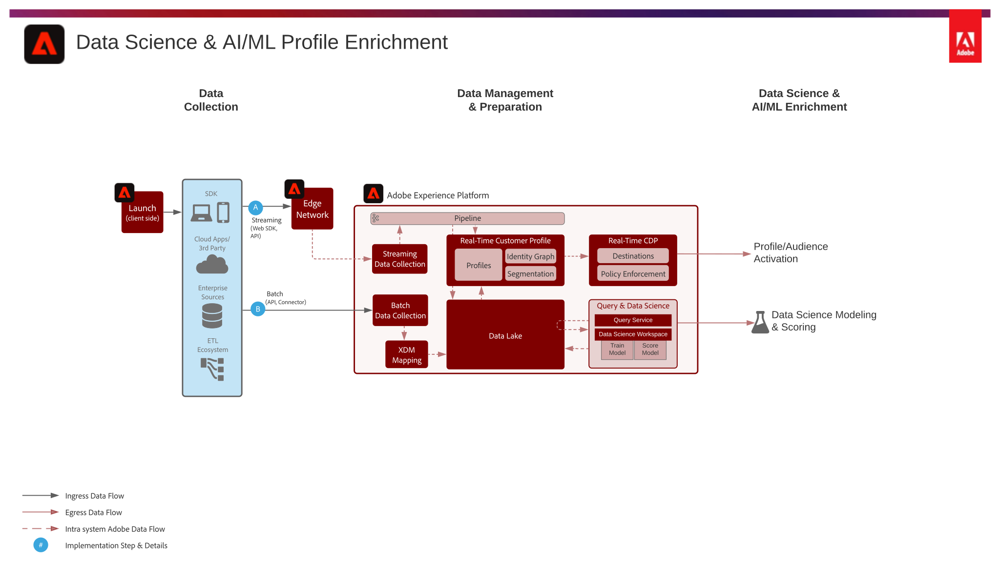

# Data Science and Profile Enrichment Blueprint

## Description

Data Science & AI/ML Profile Enrichment details the ability to utilize Adobe Experience Platform's Data Science Workspace to train, deploy, and score models on data within Experience Platform's Data Lake to provide machine learning insights from the data. These insights and models can directly output to a dataset enabled for profile, enabling machine learning insights to further enrich the real-time customer profile.

Examples can include determining customer lifetime value, product and category affinity, propensity to convert or propensity to churn as a few examples. 

## Scenarios

<<<<<<< HEAD

| Scenario | Scenario Description | Experience Cloud Applications |
|---|---|---|
|Exploratory Data Science | Exploratory data science – discover signal, completeness, correctness of data Discover new insights using data science tooling | Experience Platform Intelligence |
|Profile enrichment with AI/ML  - batch | Discover, author, train, deploy, score model - output – in batch Push model prediction to profile or to data lake for batch based activation. | Experience Platform Intelligence |

## Architecture

## Implementation Steps

* Data loaded/ingested to Experience Platform – schema, datasets created and data loaded.
* Create a DSW notebook.
* Choose a language - support for Python and PySpark.
* Author model in notebook.
* Train the model.
* Score the model to generate predictions with the target data.
* If pushing model results to the Real-time Customer Profile the model results dataset is enabled for Profile and the machine learned attributes are ingested to Profile.

## FAQs & Reference Documentation

* [Product Description](https://helpx.adobe.com/legal/product-descriptions/adobe-experience-platform-intelligence---product-description.html)
* [Product Documentation](https://experienceleague.adobe.com/docs/experience-platform/data-science-workspace/home.html?lang=en)

## Related Blog Posts

* [Simplifying the Data Science Lifecycle with Adobe Platform Experience](https://medium.com/adobetech/simplifying-the-data-science-lifecycle-with-adobe-platform-experience-8ea4f056d82f)
* [Content and Commerce AI: Personalizing Your Interactions with Customers Through Content Intelligence](https://medium.com/adobetech/content-and-commerce-ai-personalizing-your-interactions-with-customers-through-content-intelligence-dc182601deab)
* [Gaining a Deeper Understanding of Churn Using Data Science Workspace](https://medium.com/adobetech/gaining-a-deeper-understanding-of-churn-using-data-science-workspace-18a2190e0cf3)
* [Understanding Data Science In Adobe Experience Platform](https://medium.com/adobetech/understanding-data-science-in-adobe-experience-platform-5bce5a17b42)
* [An Introductory Look at Exploratory Data Analysis on Adobe Experience Platform](https://medium.com/adobetech/an-introductory-look-at-exploratory-data-analysis-on-adobe-experience-platform-1bfce7501d9a)
* [Cutting Across Adobe Experience Products with Machine Learning to Elevated User Experience](https://medium.com/adobetech/cutting-across-adobe-experience-products-with-machine-learning-to-elevated-user-experience-7c85000510d1)
* [Modeling XDM Data for Data Science at Scale on Adobe Experience Platform](https://medium.com/adobetech/modeling-xdm-data-for-data-science-at-scale-on-adobe-experience-platform-222bb2a6dbf7)
* [Segmentation.AI: Automated Audience-Clustering-as-a-Service in Adobe Experience Platform](https://medium.com/adobetech/segmentation-ai-automated-audience-clustering-as-a-service-in-adobe-experience-platform-261f4099462c)
* [Reimagining Jupyter Notebooks for Enterprise Scale](https://medium.com/adobetech/reimagining-jupyter-notebooks-for-enterprise-scale-8bc6340d504a)
* [Accelerate Intelligent Insights with Adobe Experience Platform Data Science Workspace](https://medium.com/adobetech/accelerate-intelligent-insights-with-adobe-experience-platform-data-science-workspace-89538bacbbea)
* [A Preview of Time Series Forecasting with Adobe Experience Platform](https://medium.com/adobetech/preview-of-time-series-forecasting-with-adobe-experience-platform-38a2fc778e89)
* [Cutting Across Adobe Experience Products with Machine Learning to Elevated User Experience](https://medium.com/adobetech/cutting-across-adobe-experience-products-with-machine-learning-to-elevated-user-experience-7c85000510d1)

