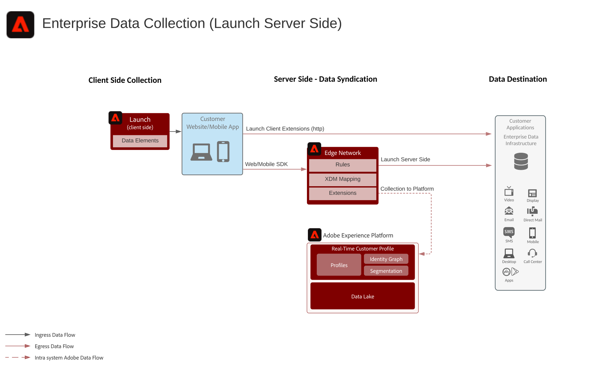

# Enterprise Data Collection

## Description

Enterprise data collection addresses the ability to collect data from Adobe's SDK on web and mobile and to forwarded collected data from Adobe's server to a desired destination. This can include all raw data collected from the SDK or data based on specific events and rules as configured in the Adobe Launch tool.

## Architecture

## FAQs & Reference Documentation

[Documentation](https://experienceleague.adobe.com/docs/launch/using/server-side-info/server-side-overview.html?lang=en#server-side-info)