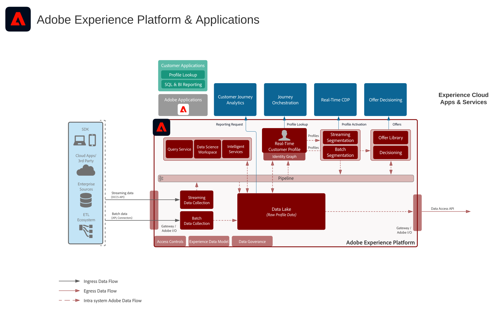

# Adobe Experience Platform & Applications architecture diagram

This architecture diagram shows how Adobe Experience Platform relates to Adobe Experience Cloud applications and application services.

>[!VIDEO](https://video.tv.adobe.com/v/32456/?quality=12&learn=on)