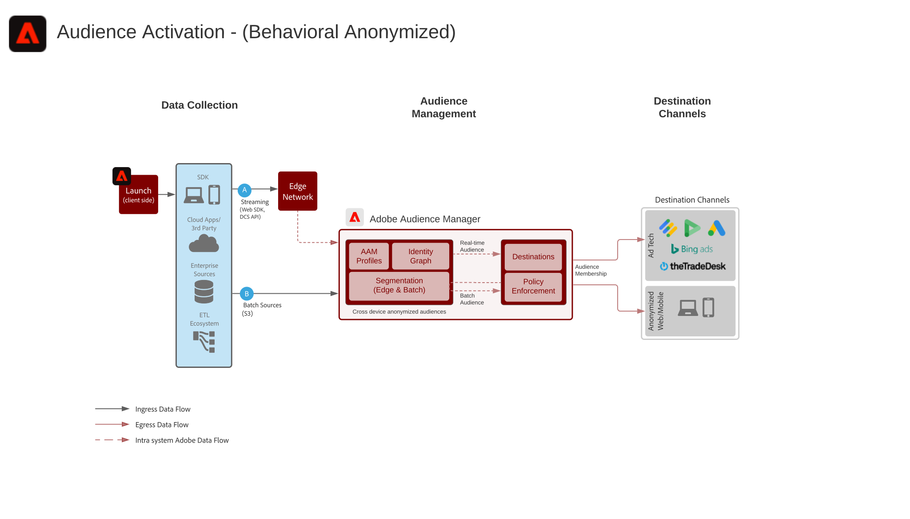

# Digital Experience Blueprints

Digital Experience Blueprints are repeatable implementations to address strategy and solve established business problems. Blueprints accelerate time-to-value and provide a fast path to success.

Each Blueprint offers Adobe customers a series of artifacts that explain the high-value business problem, architectures, implementation steps, technical considerations, and links to the relevant documentation.

## What's New

* **[Audience and Profile Activation to Enterprise Destinations Blueprint](/help/blueprints/audience-activation/enterprise-destinations.md)**
    *Keep customer profiles up-to-date across all systems to empower your sales and support teams.​*
* **[Customer Activity Hub Blueprint](/help/blueprints/audience-activation/customer-activity.md)**
    *Provide context for agent-assisted support and sales.*
* **[Data Analysis and Intelligence Blueprint](/help/blueprints/data-insights/analysis.md)**
    *Perform exploratory query and analysis of the data in the data lake.*

## Featured Blueprints

<table style="table-layout:fixed">
<tr>
  <td>
    
    
<a href="https://experienceleague.adobe.com/docs/blueprints-learn/architecture/web-personalization/overview.html"><strong>Web/Mobile Personalization Blueprint</strong></a>

    
<em>Deliver personalized web and mobile content.</em>

  </td>
  <td>
    
    
<a href="https://experienceleague.adobe.com/docs/blueprints-learn/architecture/audience-activation/overview.html"><strong>Audience Activation Blueprint</strong></a>

    
<em>Deliver audience-activated cross-channel advertising.</em>

  </td>
  <td>
    
    
<a href="https://experienceleague.adobe.com/docs/blueprints-learn/architecture/multi-channel-message-orchestration/overview.html"><strong>Multi-channel Orchestration Blueprint</strong></a>

    
<em>Deliver individual, just-in-time customer experiences across screens.</em>

  </td>
</tr>
</table>

## Blog Posts

* [!DNL Introducing Adobe Experience Platform’s New Digital Experience Blueprints](https://medium.com/adobetech/introducing-adobe-experience-platforms-new-digital-experience-blueprints-93a6b5f5da7c)
* [!DNL Blueprint for Audience Activation in Adobe Experience Platform](https://medium.com/adobetech/a-blueprint-for-audience-activation-in-adobe-experience-platform-b2b30fae90fd)
* [!DNL Blueprint for Web Personalization using Adobe Experience Platform Real-Time Customer Profile](https://medium.com/adobetech/blueprint-for-web-personalization-using-adobe-experience-platform-real-time-customer-profile-fef2ce7a4b2f)
* [!DNL Blueprint for Multi-Channel Orchestration in Adobe Experience Platform](https://medium.com/adobetech/blueprint-for-multi-channel-orchestration-in-adobe-experience-platform-c68317e94184)
