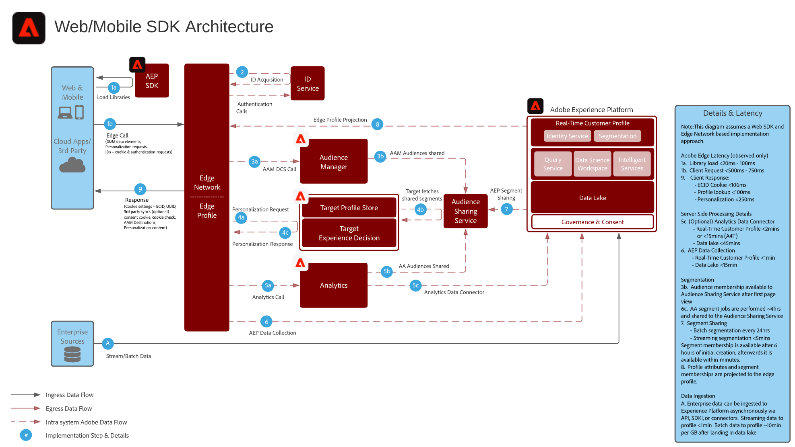

# Behavioral Web Personalization scenario

Personalize based on online behavior and audience data.

## Use Cases

* Landing page optimization
* Behavioral Targeting
* Personalization based on prior product/content views, product/content affinity, environmental attributes, 3rd party audience data and demographics

## Reference Architecture

## Prerequisites

| Application/Service | Required Library |  Notes | 
|---|---|---|
| Adobe Target | Platform Web SDK*, at.js 0.9.1+ or mbox.js 61+ | at.js is preferred as mbox.js is no longer being developed. |
| Adobe Audience Manager (Optional) | Platform Web SDK* or dil.js 5.0+ |  |
| Adobe Analytics (Optional) | Platform Web SDK* or AppMeasurement.js 1.6.4+ |  |
| Experience Cloud ID service | Platform Web SDK* or VisitorAPI.js 2.0+ |  |
| Experience Cloud Audiences (Optional) | n/a |  |
| Launch Edge Configuration   (if using Experience Platform Web SDK) | n/a |  |
| Mobile SDK (Optional) | 4.11 or higher for iOS and Android |  |
| Experience Platform Web SDK | 1.0, current Experience Platform SDK version has a number of use cases not yet supported for the Experience Cloud applications as noted in the [Experience Platform Web SDK documentation](https://experienceleague.adobe.com/docs/experience-platform/edge/home.html)| |

## Guardrails

Availability: Global

Audience Sharing: By default the segment sharing service allows a maximum of 75 audiences to be shared for each Analytics report suite. If AAM is being used for audience sharing there is no limit on the number of audiences that can be shared. 

## Implementation Steps

* Implement Adobe Target
* Implement AAM or Analytics
* Implement Visitor ID service
* Provision People and Audience Sharing services

## Data Flow Implementation Diagram

The Web/Mobile personalization blueprint can be implemented using either traditional app specific SDKs, or by using the WebSDK and Experience Edge Network.

* WebSDK/MobileSDK and Experience Edge Approach

* Application Specific SDK Approach

## FAQs & Reference Documentation

1. [Experience Cloud Audiences](https://experienceleague.adobe.com/docs/core-services/interface/audiences/audience-library.html)
2. [Integrate Audience Manager with Target](https://experienceleague.adobe.com/docs/audience-manager/user-guide/implementation-integration-guides/integration-other-solutions/aam-target-integration.html)
3. [Analytics Segment Sharing through AAM](https://experienceleague.adobe.com/docs/analytics/components/segmentation/segmentation-workflow/seg-publish.html)

## Related Blog Posts

* [Blueprint for Web Personalization using Adobe Experience Platform Real-Time Customer Profile](https://medium.com/adobetech/blueprint-for-web-personalization-using-adobe-experience-platform-real-time-customer-profile-fef2ce7a4b2f)
* [Integrating Adobe Experience Platform Decisioning Engine with AEM Websites](https://jaeness.medium.com/integrating-adobe-experience-platform-decisioning-engine-with-aem-websites-9c222acd12e2)
* [How Adobe Experience Platform Predictive Audiences improves Personalized Experiences](https://medium.com/adobetech/how-adobe-experience-platform-predictive-audiences-improves-personalized-experiences-1f75a60cb7a3)
* [Adobe Experience Platform Web SDK for Audience Management](https://medium.com/adobetech/adobe-experience-platform-web-sdk-for-audience-management-751fa6d063bc)
* [Implementing Adobe Experience Platform Real-Time Customer Profile through our “Customer Zero” Program](https://medium.com/adobetech/implementing-adobe-experience-platform-real-time-customer-profile-through-our-customer-zero-32e7cd952896)
* [How Adobe Experience Platform Can Help Customers Personalize Their Mobile Messaging in Real-Time with Journey Orchestration Service and a Mobile Messaging Vendor](https://medium.com/adobetech/how-adobe-experience-platform-helped-a-client-personalize-their-mobile-messaging-in-real-time-with-7d634aefa098)
* [Segmentation in Seconds: How Adobe Experience Platform Made Real-time Customer Profiles a Reality](https://medium.com/adobetech/segmentation-in-seconds-how-adobe-experience-platform-made-real-time-customer-profiles-a-reality-a7a8552b0847)