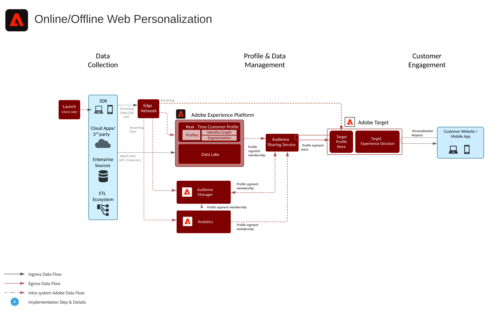
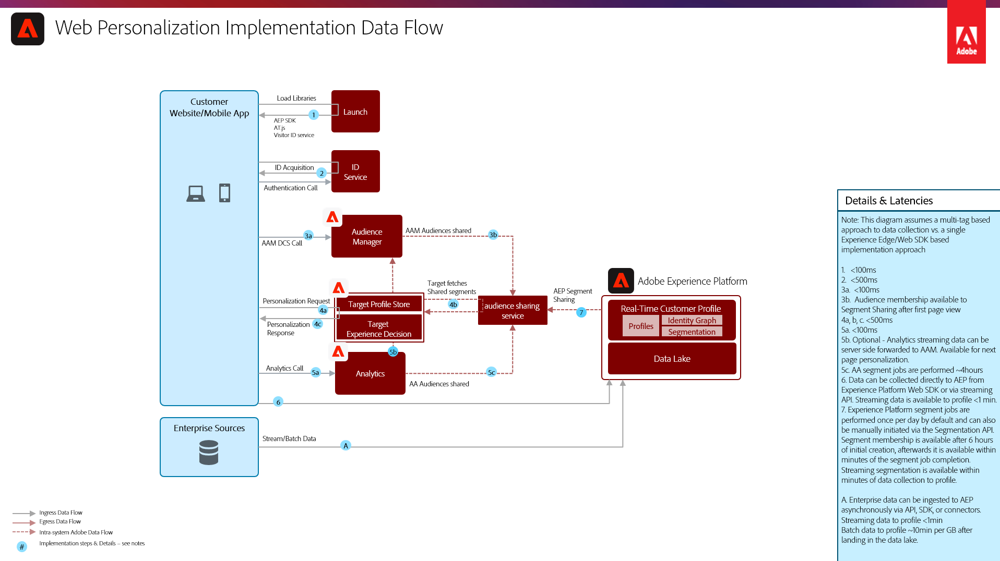

# Online/Offline Web/Mobile Personalization Blueprint

Synchronize web personalization with email and other known and anonymous channel personalization.

## Use Cases

* Landing page optimization
* Behavioral and offline profile targeting
* Personalization based on prior product/content views, product/content affinity, environmental attributes, third-party audience data, and demographics in addition to offline insights such as transactions, loyalty and CRM data, and modeled insights

## Applications

* [!UICONTROL Real-time Customer Data Platform]
* Adobe Target
* Adobe Audience Manager (optional): Adds third-party audience data, co-op based device graph, the ability to surface Platform segments in Adobe Analytics, and the ability to surface Adobe Analytics segments in Platform
* Adobe Analytics (optional): Adds the ability to build segments based on historical behavioral data and fine grained segmentation from Adobe Analytics data

## Architecture

## Guardrails

### Guardrails for Segment Evaluation and Activation

| Segmentation Type | Frequency | Throughput | Latency (Segment Evaluation) | Latency (Segment Activation) |
|-|-|-|-|-|
| Edge Segmentation | Edge segmentation is currently in beta and allows for valid real-time segmentation to be evaluated on the Experience Platform Edge Network for real-time, same page decisioning via Adobe Target and Adobe Journey Optimizer. |  | ~100 ms | Available immediately for personalization in Adobe Target, for profile lookups in the Edge Profile, and for activation via cookie based destinations. |
| Streaming Segmentation | Every time a new streaming event or record is ingested into the real-time customer profile and the segment definition is a valid streaming segment.  See the [segmentation documentation](https://experienceleague.adobe.com/docs/experience-platform/segmentation/api/streaming-segmentation.html) for guidance on streaming segment criteria  | Up to 1500 events per second.  | ~ p95 <5min | Once these segment realizations occur they are shared to Audience Manager and the audience sharing service within minutes and available for same/next page personalization in Adobe Target. |
| Incremental Segmentation | Once per hour for new data that has been ingested into the real-time customer profile since the last incremental or batch segment evaluation. |  |  | Once these segment memberships are realized they are shared to Audience Manager and the audience sharing service within minutes and available for same/next page personalization in Adobe Target. |
| Batch Segmentation | Once per day based on a predetermined system set schedule, or manually initiated ad hoc via API. |  | Approximately one hour per job for up to 10 TB profile store size, 2 hours per job for 10 TB to 100 TB profile store size. Batch segment job performance is dependent upon number profiles, size of profiles and number of segments being evaluated. | Once these segment memberships are realized they are shared to Audience Manager and the audience sharing service within minutes and available for same/next page personalization in Adobe Target. |

### Guardrails for cross application audience sharing

| Audience Sharing Integration Pattern | Detail | Frequency | Throughput | Latency (Segment Evaluation) | Latency (Segment Activation) |
|-|-|-|-|-|-|
| Real-time Customer Data Platform to Audience Manager |  | Dependent on segmentation type - see above segmentation guardrails table. | Dependent on segmentation type - see above segmentation guardrails table. | Dependent on segmentation type - see above segmentation guardrails table. | Within minutes of completion of the segment evaluation. Initial audience configuration sync between Real-time Customer Data Platform and Audience Manager takes approximately 4 hours. Any audience memberships realized during the 4 hour period will be written to Audience Manager on the subsequent batch segmentation job as "existing" audience memberships. |
| Adobe Analytics to Audience Manager | By default a maximum of 75 audiences can be shared for each Adobe Analytics report suite. If an Audience Manager license is used, there is no limit on the number of audiences that can be shared between Adobe Analytics and Adobe Target or Adobe Audience Manager and Adobe Target. |  |  |  |  |
| Adobe Analytics to Real-time Customer Data Platform | Not currently available. |  |  |  |  |

## Implementation Patterns

The Web/Mobile personalization blueprint can be implemented via the following approaches as outlined below.

1. Using the [!UICONTROL Platform Web SDK] or [!UICONTROL Platform Mobile SDK] and [!UICONTROL Edge Network].
1. Using traditional application-specific SDKs (for example, AppMeasurement.js)

### 1. Platform Web/Mobile SDK and Edge Approach

### 2. Application-specific SDK Approach

## Implementation Prerequisites

| Application/Service | Required Library |  Notes | 
|---|---|---|
| Adobe Target | [!UICONTROL Platform Web SDK]*, at.js 0.9.1+, or mbox.js 61+ | at.js is preferred as mbox.js is no longer being developed. |
| Adobe Audience Manager (Optional) | [!UICONTROL Platform Web SDK]* or dil.js 5.0+ |  |
| Adobe Analytics (Optional) | [!UICONTROL Platform Web SDK]* or AppMeasurement.js 1.6.4+ | Adobe Analytics tracking must use Regional Data Collection (RDC). |
| Experience Cloud ID service | [!UICONTROL Platform Web SDK]* or VisitorAPI.js 2.0+ | (Recommended) Use Experience Platform Launch to deploy the ID service to ensure that the ID is set before any application calls |
| Experience Platform Mobile SDK (Optional) | 4.11 or higher for iOS and Android™ |  |
| Experience Platform Web SDK | 1.0, current Experience Platform SDK version has [various use cases not yet supported for the Experience Cloud applications](https://github.com/adobe/alloy/projects/5)| |

## Implementation Steps

1. [Implement Adobe Target](https://experienceleague.adobe.com/docs/target/using/implement-target/implementing-target.html) for your web or mobile applications
1. [Implement Adobe Audience Manager](https://experienceleague.adobe.com/docs/audience-manager/user-guide/implementation-integration-guides/implement-audience-manager.html) (optional)
1. [Implement Adobe Analytics](https://experienceleague.adobe.com/docs/analytics/implementation/home.html)  (optional)
1. [Implement Experience Platform and [!UICONTROL Real-time Customer Profile]](https://experienceleague.adobe.com/docs/platform-learn/getting-started-for-data-architects-and-data-engineers/overview.html)
1. Implement [Experience Cloud Identity Service](https://experienceleague.adobe.com/docs/id-service/using/implementation/implementation-guides.html) or [Experience Platform Web SDK](https://experienceleague.adobe.com/docs/experience-platform/edge/home.html)
    >[!NOTE]
    >
    >Each application must use the Experience Cloud ID and be part of the same Experience Cloud Org to allow audience sharing between applications.
1. [Request provisioning for Audience Sharing between Experience Platform and Adobe Target (Shared Audiences)](https://www.adobe.com/go/audiences)

## Related Documentation

* [Experience Platform segment sharing with Audience Manager and other Experience Cloud solutions](https://experienceleague.adobe.com/docs/audience-manager/user-guide/implementation-integration-guides/integration-experience-platform/aam-aep-audience-sharing.html)
* [Experience Platform Segmentation Overview](https://experienceleague.adobe.com/docs/experience-platform/segmentation/home.html)
* [Streaming Segmentation](https://experienceleague.adobe.com/docs/experience-platform/segmentation/api/streaming-segmentation.html)
* [Experience Platform Segment Builder Overview](https://experienceleague.adobe.com/docs/experience-platform/segmentation/ui/overview.html)
* [Audience Manager Source Connector](https://experienceleague.adobe.com/docs/experience-platform/sources/connectors/adobe-applications/audience-manager.html)
* [Adobe Analytics Segment Sharing through Adobe Audience Manager](https://experienceleague.adobe.com/docs/analytics/components/segmentation/segmentation-workflow/seg-publish.html)
* [Experience Platform Web SDK documentation](https://experienceleague.adobe.com/docs/experience-platform/edge/home.html)
* [Experience Cloud ID Service documentation](https://experienceleague.adobe.com/docs/id-service/using/home.html)
* [Experience Platform Launch documentation](https://experienceleague.adobe.com/docs/launch/using/home.html)

## Related Blog Posts

* [[!DNL Blueprint for Web Personalization using Adobe Experience Platform Real-Time Customer Profile]](https://medium.com/adobetech/blueprint-for-web-personalization-using-adobe-experience-platform-real-time-customer-profile-fef2ce7a4b2f)
* [[!DNL Build an Optimal Online Experience: Enrich Unified Profile with Query Service]](https://medium.com/adobetech/build-an-optimal-online-experience-enrich-unified-profile-with-query-service-8027c196ab33)
* [[!DNL Integrating Adobe Experience Platform Decisioning Engine with AEM Websites]](https://jaeness.medium.com/integrating-adobe-experience-platform-decisioning-engine-with-aem-websites-9c222acd12e2)
* [[!DNL Adobe Experience Platform’s Identity Service — How to Solve the Customer Identity Conundrum]](https://medium.com/adobetech/adobe-experience-platforms-identity-service-how-to-solve-the-customer-identity-conundrum-f95e22d16ea9)
* [[!DNL How Adobe Experience Platform Predictive Audiences improves Personalized Experiences]](https://medium.com/adobetech/how-adobe-experience-platform-predictive-audiences-improves-personalized-experiences-1f75a60cb7a3)
* [[!DNL Adobe Experience Platform Web SDK for Audience Management]](https://medium.com/adobetech/adobe-experience-platform-web-sdk-for-audience-management-751fa6d063bc)
* [[!DNL Implementing Adobe Experience Platform Real-Time Customer Profile through our “Customer Zero” Program]](https://medium.com/adobetech/implementing-adobe-experience-platform-real-time-customer-profile-through-our-customer-zero-32e7cd952896)
* [[!DNL How Adobe Experience Platform Can Help Customers Personalize Their Mobile Messaging in Real-Time with Journey Orchestration Service and a Mobile Messaging Vendor]](https://medium.com/adobetech/how-adobe-experience-platform-helped-a-client-personalize-their-mobile-messaging-in-real-time-with-7d634aefa098)
* [[!DNL Segmentation in Seconds: How Adobe Experience Platform Made Real-time Customer Profiles a Reality]](https://medium.com/adobetech/segmentation-in-seconds-how-adobe-experience-platform-made-real-time-customer-profiles-a-reality-a7a8552b0847)
* [[!DNL Build an Optimal Online Experience: Enrich Unified Profile with Query Service]](https://medium.com/adobetech/build-an-optimal-online-experience-enrich-unified-profile-with-query-service-8027c196ab33)
