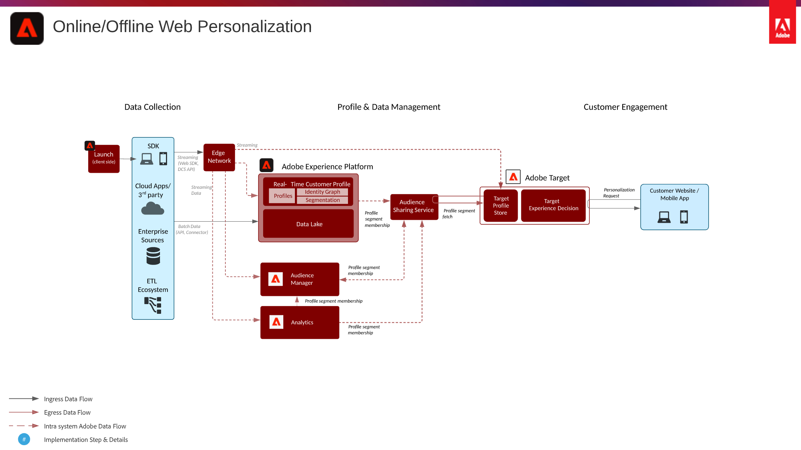

# Online/Offline Web Personalization scenario

Synchronize web personalization with email and other known and anonymous channel personalization.

## Use Cases

* Landing page optimization
* Behavioral and offline profile targeting
* Personalization based on prior product/content views, product/content affinity, environmental attributes, 3rd party audience data and demographics in addition to offline insights such as transactions, loyalty and CRM data, and modeled insights

## Reference Architecture

## Prerequisites

1 – Provisioning

* Adobe Experience Platform, Activation or RTCDP
* Adobe Target
* Adobe Audience Manager (Optional)
* Adobe Analytics (Optional)

2 – Visitor ID service or WebSDK must be implemented to have synced Experience Cloud IDs across applications. It is strongly recommended to leverage Experience Platform Launch to deploy the ID service to ensure the ID is set prior to any application calls.

3 – For Analytics integration, all Analytics tracking must have been converted to Regional Data Collection. RDC.

4 – Minimum code versions are as follows.

* Experience Cloud ID service – VisitorAPI.js 2.0 or higher
* Analytics – AppMeasurement.js 1.6.4 or higher
* Audience Manager – dil.js 5.0 or higher
* Target – mbox.js 61, at.js .9.1. at.js is preferred as mbox.js is no longer being developed.
* Mobile SDK – 4.11 for iOS and Android
* AEP Web SDK – 1.0, current AEP SDK version has a number of use cases not yet supported for the AEC applications as noted in the AEP Web SDK documentation here - [Link](https://docs.adobe.com/content/help/en/experience-platform/edge/home.html)

## Guardrails

### Availability

Global

### Sandbox support

Audience sharing of Platform audiences to Audience Manager and Target is only available on Production sandbox

See profile and data ingestion guardrails

### Audience Sharing

* By default the segment sharing service allows a maximum of 75 audiences to be shared for each Analytics report suite. If the customer has an Audience Manager license, there is no limit on the number of audiences that can be shared between Adobe Analytics and Target or Audience Manager and Target.
* Note that segment realization from Platform is latent for both batch (1 per day) and streaming (~2 min) therefore segment rules based on same session data for same session personalization should be powered by Audience Manager. For personalization use cases, Platform best used for long historical segmentation or segment activation of offline data to web.
* Batch Segment sharing – once per day latency, or manually initiated via API ad hoc Streaming Segmentation available within minutes
* Shared segments available in Target for next page personalization, first page/hit is to establish profile sync between segment share service and Target
* Concerning the ~6 hour delay of new segments being initiated. It takes ~5 hours for the Audience Manager metadata (segment rules) to get from the MySQL data-base to the Audience Manager EDGE data collection system. While metadata is not available on the Audience Manager EDGE, Audience Manager will not be able to record the segment data.
* The segment sharing service listens for segment change events via projection on the pipeline, from this standpoint the segment sharing service is not concerned with whether the segment is batch or streaming, it simply consumes the segment change events
* Experience events and Profile records that have not been updated as of the last 14 days will not have a current record in the region hint routing information. As such these profiles will route through a slower batch based path to Audience Manager which can take up to ~48 hrs to activate.

## Application Support

* Audience Manager is optional and adds the following: 3rd party audience data, co-op based device graph, ability to surface Platform segments in Adobe Analytics and Adobe Analytics segments in Platform.
* Analytics is optional and adds the ability to build segments based on historical behavioral data and fine grained segmentation from Adobe Analytics data.

## Data Flow & Implementation Diagram

The Web/Mobile personalization blueprint can be implemented using either traditional app specific SDKs, or by using the WebSDK and Experience Edge Network.

* WebSDK/MobileSDK and Experience Edge Approach

* Application Specific SDK Approach

## Implementation Steps

* Implement Adobe Target
* Implement AAM and/or Analytics (optional)
* Implement Platform and Real-time Customer Profile
* Implement Visitor ID service or WebSDK
* Provision People and Audience core service
* Provision Audience Sharing between AEP and Target

## FAQ & Reference

* [Bidirectional Segment Sharing Overview](https://experienceleague.adobe.com/docs/audience-manager/user-guide/implementation-integration-guides/integration-experience-platform/aam-aep-audience-sharing.html)
* [Experience Platform Segmentation Overview](https://experienceleague.adobe.com/docs/experience-platform/segmentation/home.html)
* [Streaming Segmentation](https://experienceleague.adobe.com/docs/experience-platform/segmentation/api/streaming-segmentation.html)
* [Experience Platform Segment Builder Overview](https://experienceleague.adobe.com/docs/experience-platform/segmentation/ui/overview.html)
* Audience Manager Solution Connector Overview
* [Analytics Segment Sharing through AAM](https://experienceleague.adobe.com/docs/analytics/components/segmentation/segmentation-workflow/seg-publish.html)
* Streaming Segmentation Guidelines
* [AEP Web SDK Documentation](https://experienceleague.adobe.com/docs/experience-platform/edge/home.html)
* [Experience Cloud ID Service Documentation](https://experienceleague.adobe.com/docs/id-service/using/home.html)
* [Experience Platform Launch Documentation](https://experienceleague.adobe.com/docs/launch/using/overview.html)
