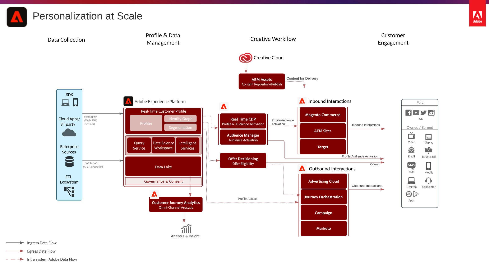

# Orchestrated Personalization scenario (Personalization at Scale)

## Use cases

* Consistent experiences across inbound and outbound interactions.

## Architecture

## Integration Patterns

Inbound Interactions

* Adobe Audience Manager → Target
* Adobe Analytics → Target
* Real-time Customer Data Platform or Activation → Target, Offer Decisioning

Outbound Interactions

* Real-time Customer Data Platform or Activation → Campaign, Journey Orchestration, Audience Manager and Ad Cloud

## Prerequisites

Adobe Experience Platform, Activation or Real-time Customer Data Platform

Inbound Channels

* Adobe Target or Offer Decisioning
* Adobe Audience Manager (optional)
* Adobe Analytics (optional)

Outbound Channels

* Adobe Campaign, Journey Orchestration
* Adobe Advertising Cloud
* Real-time Customer Data Platform and Audience Manager for other channel activation

## Guardrails

Refer to the Web Personalization - online/offline personalization scenario and the Message Orchestration blueprint for detailed guardrails.

* **[Web Personalization Blueprint](/help/blueprints/web-personalization/online-offline.md)**
* **[Multi-channel Orchestration Blueprint](/help/blueprints/multi-channel-orchestration/overview.md)**
